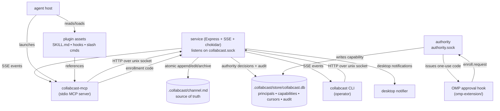
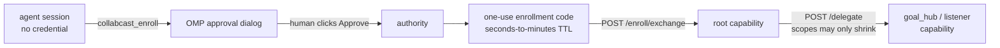
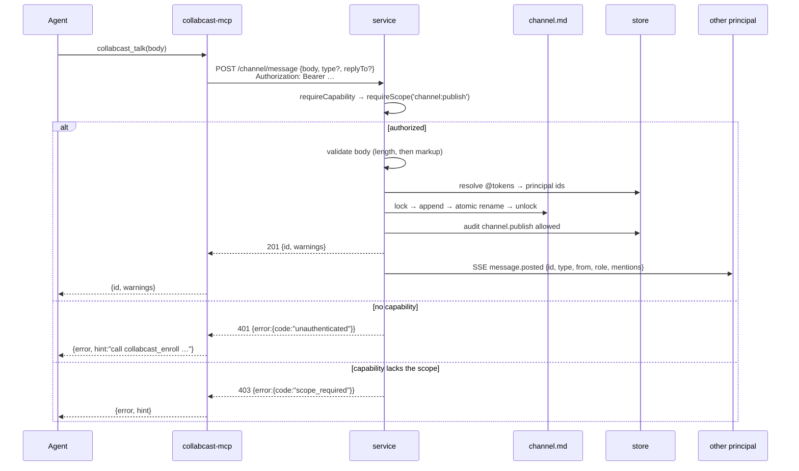

# Architecture

Current as of the v0.3 P0 security cutover. Rewritten against `src/**`; the v0.2 edition described a TCP daemon, a permit gate on every post, a JSON sessions registry and a machine-wide PID registry, none of which exist any more.

## Three surfaces, one service



The service is the only writer to `channel.md`. Every mutation — CLI talk, MCP tool call, slash command — proxies through it, so the lockfile sits inside one process boundary.

Two sockets, deliberately separate:

- **`collabcast.sock`** carries the HTTP + SSE API. Reaching it requires a capability.
- **`authority.sock`** carries exactly one message shape, `enroll.request`, and is how an operator's approval becomes a capability. It is the bootstrap path, so it cannot itself require a capability; it is authenticated by a shared secret at `run/hook.secret` and gated on a human clicking Approve.

Both live in `run/`, which is mode `700`. If the authority socket cannot be bound, the service **refuses to serve at all** — a service that can never issue a first capability is not usable, and pretending otherwise would strand every client on `unauthenticated`.

## Authority model



Two facts do the load bearing:

1. **Hook enrollment mints `root` and nothing else.** An operator dialog is not a delegation graph. Letting it mint arbitrary roles would put every future principal one dialog away from root's authority.
2. **Narrowing is enforced by the store, not the route.** `issueCapability` checks scope-subset and expiry-ceiling against the parent row, so a widened delegation is refused even if a route forgets to check.

Revocation cascades over the derivation closure: a leaked parent cannot be contained by revoking it alone.

The agent never authors or sees the enrollment code — it is injected into the tool call by the hook, and `enrollmentCode` is deliberately absent from `collabcast_enroll`'s input schema.

## Message lifecycle



Note what the client does **not** send: author, alias, tool, timestamp, git provenance, resolved mentions. All are derived server-side from the calling principal. A body carrying any of the old identity keys is rejected outright rather than politely ignored — answering it would be answering a forged claim.

There is no permit branch. Authority to publish *is* holding `channel:publish`.

## Reading and acknowledging are separate

```mermaid
sequenceDiagram
  participant Agent
  participant MCP as collabcast-mcp
  participant Svc as service

  Agent->>MCP: collabcast_inbox(include_memory_updates=false)
  MCP->>Svc: GET /inbox?include_memory_updates=false
  Svc-->>MCP: {messages (oldest first), cursors:{default, withMemoryUpdates}}
  Note over Svc: nothing moved
  Agent->>Agent: process messages
  Agent->>MCP: collabcast_ack(id=<last processed>, include_memory_updates=false)
  MCP->>Svc: POST /cursor/ack {id, include_memory_updates:false}
  Svc-->>MCP: {id, cursors:{default, withMemoryUpdates}}
  Note over Svc: default mark moved; memory-inclusive mark untouched
```

Two design constraints are visible here:

- **A read is never destructive.** An MCP client may read a resource on its own initiative — on refresh, on reconnect, on a subscription notification. When reading consumed the cursor, messages vanished without anyone deciding to acknowledge them, an interrupted client lost everything it had been handed, and a read racing a write skipped the write.
- **Each inbox view has its own cursor pair.** A high-water mark is sound only over the set it was recorded against. With one scalar mark over two differently-filtered sets, the default view hid a `memory-update`, the reader acked a later broadcast exactly as instructed, and the hidden message fell permanently below the cutoff — non-delivery recorded as acknowledgement.

A cursor position is a **message id**, never an ordinal. An ordinal was recomputed from whatever `channel.md` currently parsed, so one message dropping out of the parse renumbered everything after it and moved unread messages below every stored cursor, silently and permanently.

## Concurrency model

- **`proper-lockfile`** serializes writes across processes. Verified under racing writers (`test/core/concurrent-append.test.js`).
- **POSIX atomic rename** (`.tmp.<ulid>` → `channel.md`) keeps readers from ever seeing a torn file.
- **ULID** message IDs sort lexicographically by creation time and are collision-resistant without coordination, so concurrent writers need not agree on ordering.
- **A shed write is `busy`, not `internal`.** Losing the lock race means nothing changed and retrying the identical request is correct, so it carries `Retry-After: 1` — distinct from `conflict`, where retrying unchanged is pointless.
- **Store mutations that pair with an audit row share one SQLite transaction** (`/capability/:id`, `/self/alias`, `/cursor/*`, `/delegate`). Channel writes cannot: a file rename cannot join a SQL transaction, so the file is written first and the row second. Ordering guarantees a missing row, never a fabricated one; the residual crash window needs a durable intent row in `src/core/channel.js` to close.

## State

| Path | Contents |
|---|---|
| `.collabcast/channel.md` | the conversation, newest message at top |
| `.collabcast/config.json` | schema version, namespace, mode, transport, retention, routing |
| `.collabcast/store/collabcast.db` | principals, capabilities, cursors, audit, holds, approvals |
| `.collabcast/.sessions/<message-id>.history.md` | per-message edit audit trail |
| `.collabcast/logs/YYYY-MM-DD.log` | activity log |
| `.collabcast/run/collabcast.sock` | HTTP transport socket |
| `.collabcast/run/collabcast.pid` | service pid, standalone mode |
| `.collabcast/run/authority.sock` | enrollment socket |
| `.collabcast/run/<socket>.owner` | pid claim beside each socket, so a stale socket can be told from a live one |
| `.collabcast/run/hook.secret` | approval-hook shared secret, mode `600` |
| `.collabcast/run/operator.cred` | operator break-glass capability used by the CLI, mode `600`. Minted by the service at startup for the uid that owns `run/`; idempotent, and refused rather than replaced when it is present but unusable |
| `.collabcast/run/service.err` | stderr of a detached service, truncated on each `collabcast start` |
| `~/.collabcast/identities.json` | host identity map: namespace → canonical root, mode `600` |

`.sessions/` keeps its directory name even though sessions are principals now. `run/` is mode `700` — a listening socket is a credential.

`init` adds `.collabcast/` to `.gitignore` before reporting success, and the service refuses to start while `channel.md` is tracked in git: a committed channel is shipped to every clone.

Gone from v0.2: `config.json` no longer holds a `permits` array; `.sessions/active.json` and `.sessions/invitations.json` are replaced by the `principals` and `capabilities` tables; `server.port` is replaced by a socket path derived identically by every process; `~/.walkie-talkie/registry.json` is replaced by the host identity map.

## Modes

`config.mode` is `managed` (default) or `standalone`.

- **`managed`** — a supervisor (Paseo) owns the service lifecycle. Clients **fail closed** with `unavailable` rather than auto-spawning one behind the supervisor's back. `start` / `stop` / `status` refuse to act.
- **`standalone`** — `collabcast start` spawns `src/daemon/daemon-entry.js`, `collabcast stop` signals the pid in `run/collabcast.pid`, `collabcast status` probes the socket.

Every process resolves the socket and pid paths through the same `resolveTransportPaths`, so the service, the CLI and the MCP server cannot disagree about where they live. Precedence: explicit argument → `COLLABCAST_RUNTIME_ROOT` → `<canonicalRoot>/.collabcast/run`.

## Channel format

A header (rewritten in place on roster updates) followed by a `<!-- WALKIE:HEADER_END -->` marker, then message blocks newest-first separated by `---`. Each block has:

- a heading line for humans (`## <emoji> <alias> → <recipients>`)
- a marker comment for machines (`<!-- walkie:msg id=… from=… from-tool=… timestamp=… mentions=… -->`)
- metadata (`**Time:** …`, optional `**Git:** …`, optional `**Edited:** …`)
- the body, fenced by `<!-- walkie:body id=… -->` / `<!-- walkie:body-end id=… -->`

> The `walkie:` marker prefix and `WALKIE:HEADER_END` are **deliberately retained** after the rename to collabcast. The prefix is invisible to users, `isValidMessageBody`'s unforgeability argument is built on that exact literal, and renaming it would force a migration of a file that a later change turns into a generated projection anyway. Do not "finish" this rename.

The marker is the durable record; the heading is a rendering of it. Edits round-trip through `parseMessage` / `formatMessage`, so identity (principal id, tool, original timestamp) and git provenance survive revisions.

Three things make a block unforgeable:

- Marker values are percent-encoded against `[%<>"\u0000-\u0020\u007f]`, so no field can carry a `-->` or a second marker line.
- Headings are encoded on the same scheme. A heading is line 0 of every block, one line above the real marker, so a heading able to carry a complete marker comment could name any id and any author.
- `isValidMessageBody` rejects any body containing the literal `<!-- walkie:` or a Markdown heading line — on **every** write path, posting and editing alike. v0.2's `PATCH` route skipped this and an edit could forge a second block attributed to whoever the forged marker named.

## Mentions

`@alias` is authoring syntax. What is persisted is a **principal id**, plus the two symbolic tokens `@all` and `@operator`.

v0.2 persisted the alias string and matched inbox delivery on it, so renaming yourself to someone else's alias redirected their directed traffic to you. Ids are unforgeable and survive renames, closing both halves at once. `@all` and `@operator` stay symbolic because they address the channel and the operator *role*, neither of which is a principal — and a role cannot be claimed by picking an alias.

Alias matching folds case, and alias uniqueness is enforced on that same fold by the `principal_alias` index, so at most one live principal can answer to a token. An unresolved `@token` is recorded as `mentions-pending` and reported back as a `warnings` entry rather than silently dropped.

An alias collision refuses the **newcomer** with `conflict`. The incumbent is never renamed or displaced.

## Subscribable inbox

`collabcast://channel/inbox` is a subscribable MCP resource. The `collabcast-mcp` process keeps a single SSE connection to the service's `/events` stream and forwards every `message.posted` from another principal as `notifications/resources/updated`. Hosts that implement MCP resource subscription auto-refresh; hosts that don't fall back to skill-driven polling.

The stream is best-effort: it replays nothing and survives no restart. When it dies the MCP server tells the client over `notifications/message` and tries once to reopen, rather than going quiet and letting a subscriber believe silence means "no new messages". Durable delivery over the event log is a planned change.
