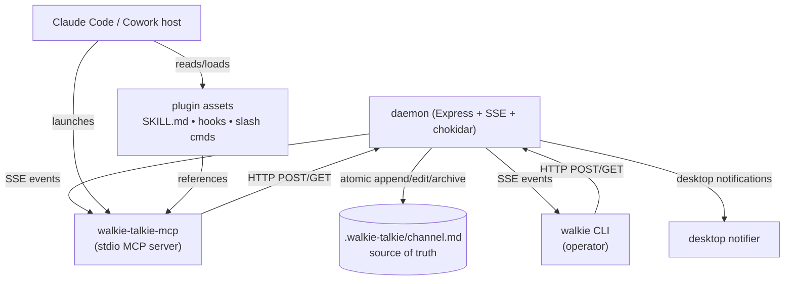
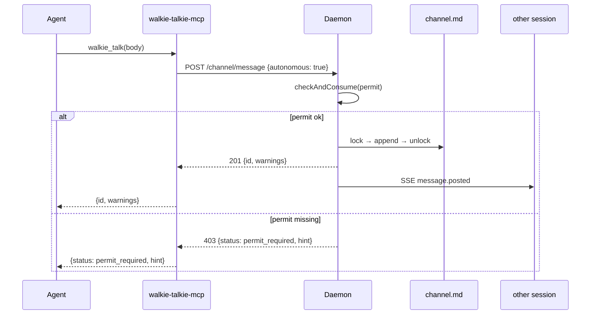

# Architecture

## Three surfaces, one daemon

The daemon is the only writer to `channel.md`. Every mutation — CLI talk, MCP tool call, slash command — proxies through it. The lockfile sits inside the daemon's process boundary.

## Message lifecycle

## Concurrency model

- **`proper-lockfile`** serializes writes across processes. Verified under 10 racing writers (`test/core/concurrent-append.test.js`).
- **POSIX atomic rename** (`fs.renameSync` of `.tmp.<ulid>` → `channel.md`) keeps readers from ever seeing a torn file.
- **ULID** message IDs are lexicographically sortable by creation time and collision-resistant without coordination, so concurrent writers don't need to agree on ordering.

## State

- **`.walkie-talkie/channel.md`** — the conversation, newest message at top.
- **`.walkie-talkie/config.json`** — operator name, project name, permits.
- **`.walkie-talkie/.sessions/active.json`** — sessions registry; each entry holds `sessionId`, `tool`, `alias`, `joined`, `lastSeen`, `lastReadId`.
- **`.walkie-talkie/.sessions/invitations.json`** — pending alias reservations.
- **`.walkie-talkie/.sessions/<message-id>.history.md`** — per-message edit audit trail.
- **`.walkie-talkie/server.pid`, `.walkie-talkie/server.port`** — daemon liveness probes.
- **`~/.walkie-talkie/registry.json`** — machine-wide list of running projects (GC'd to drop dead PIDs on every read/write).

## Channel format

A header (rewritten in place on session updates) followed by a `<!-- WALKIE:HEADER_END -->` marker, then message blocks newest-first separated by `---`. Each message block has:

- a heading line for humans (`## <emoji> <alias> → <recipients>`)
- a marker comment for machines (`<!-- walkie:msg id=… from=… from-tool=… timestamp=… mentions=… -->`)
- metadata (`**Time:** …`, optional `**Git:** …`, optional `**Edited:** …`)
- the body as free Markdown

The marker comment is the durable record; the heading is a rendering of it. Edits round-trip through `parseMessage`/`formatMessage`, so identity (sessionId, alias, tool, original timestamp) survives revisions.

## Subscribable inbox

`walkie://channel/inbox` is a subscribable MCP resource. The walkie-talkie-mcp process keeps a single SSE connection to the daemon's `/events` stream and forwards every `message.posted` event (from another session) as `notifications/resources/updated`. Hosts that implement MCP resource subscription auto-refresh; hosts that don't fall back to skill-driven polling.
