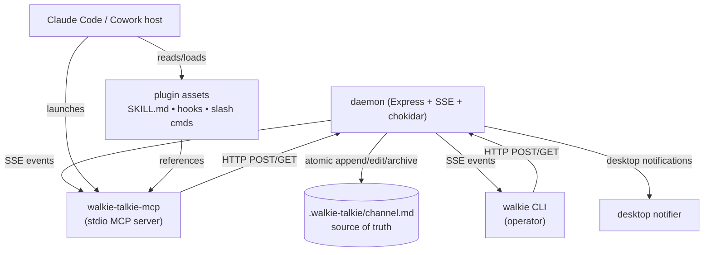
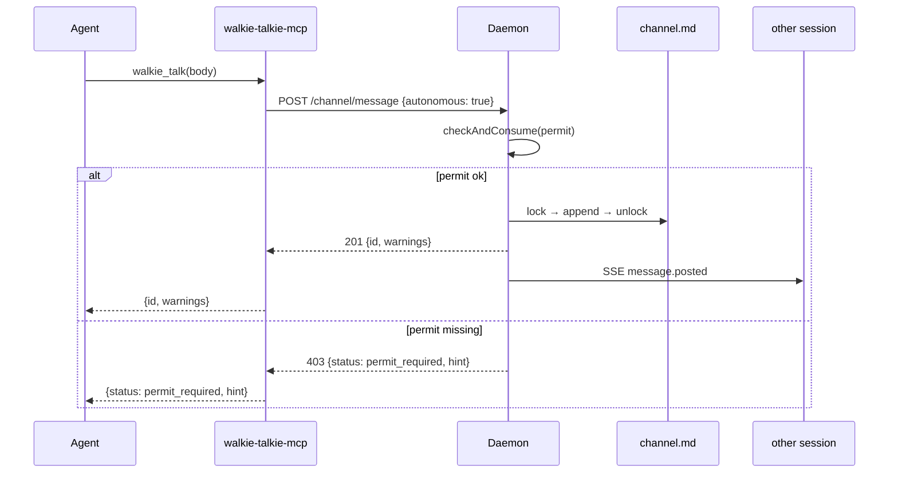

# Plan B: Claude Integration Implementation Plan

> **For agentic workers:** REQUIRED SUB-SKILL: Use superpowers:subagent-driven-development (recommended) or superpowers:executing-plans to implement this plan task-by-task. Steps use checkbox (`- [ ]`) syntax for tracking.

**Goal:** Wire the Plan A channel into Claude Code and Claude Cowork via an MCP server, scenario-driven SKILL.md, forward-compatible hooks, slash commands, full documentation, and an end-to-end harness — without bypassing the walkie-core single-writer invariant.

**Architecture:** Both Code and Cowork load a single Anthropic plugin (`plugin.json` + `mcp.json`). The plugin's MCP server (`src/mcp-server/`) speaks stdio to the host and talks to the **per-project daemon's HTTP API** for every channel mutation — daemon stays the only process holding the channel lockfile, so concurrency invariants from Plan A still hold. SKILL.md drives natural-language invocation in both environments; hooks/slash commands are explicit fallbacks. E2E harness spawns the daemon + two mock MCP clients and walks a full conversation.

**Tech Stack:** Node ≥ 18, `@modelcontextprotocol/sdk` for MCP, existing Plan A pieces (Express daemon, proper-lockfile, chokidar, ULIDs, commander). Tests with vitest + supertest. No new heavy deps.

**Spec mapping:** §16 (MCP), §17 (skill/hooks/commands), §18 (notification latency — completes the Code-hook half), §20 (memory-update integration in SKILL.md), §24 layer 3 (E2E harness), §25 (docs).

---

## File structure

### Files created

```
bin/walkie-talkie-mcp.js                       # MCP server entry script
src/mcp-server/index.js                 # MCP Server setup + transport wiring
src/mcp-server/project.js               # Project-root discovery + daemon auto-start
src/mcp-server/session.js               # Per-MCP-process session join + alias caching
src/mcp-server/tools.js                 # All 8 walkie_* tool handlers
src/mcp-server/resources.js             # 3 walkie:// resources + subscription
src/mcp-server/http-client.js           # Thin wrapper around daemon HTTP

skills/walkie-talkie/SKILL.md           # Scenario-driven skill; both Code + Cowork
hooks/hooks.json                        # SessionStart + UserPromptSubmit command hooks
hooks/scripts/check-inbox.sh            # Hook body: invokes `walkie inbox --since-last --format=context`
commands/walkie-inbox.md                # Slash command body
commands/walkie-talk.md                 # Slash command body
plugin.json                             # Anthropic plugin manifest
mcp.json                                # MCP server config

src/cli/inbox.js                        # NEW CLI command: `walkie inbox` (consumed by hooks)

docs/architecture.md
docs/setup.md
docs/api.md
docs/faq.md
examples/demo-while-presenting/README.md
examples/demo-while-presenting/transcript.md
CONTRIBUTING.md

test/mcp-server/scaffold.test.js
test/mcp-server/project.test.js
test/mcp-server/session.test.js
test/mcp-server/tools-inbox.test.js
test/mcp-server/tools-read.test.js
test/mcp-server/tools-talk.test.js
test/mcp-server/tools-reply-edit-archive.test.js
test/mcp-server/tools-sessions-rename.test.js
test/mcp-server/resources.test.js
test/helpers/mock-mcp-client.js
test/helpers/spawn-mcp.js
test/e2e/two-clients.test.js

test/daemon/inbox-route.test.js         # Per-session inbox route
test/cli/inbox.test.js                  # `walkie inbox` CLI
```

### Files modified

```
src/registry/sessions.js                # Add lastReadId per session; markRead()
src/daemon/routes/sessions.js           # New GET /sessions/:id/inbox route
src/cli/index.js                        # Register `walkie inbox` command
package.json                            # Add @modelcontextprotocol/sdk dep; add bin walkie-talkie-mcp; add npm scripts
README.md                               # Full rewrite per spec §25
```

### Design boundaries

- **Writers to `channel.md`:** still only the daemon process. The MCP server NEVER imports `src/core/channel.js` directly. It calls daemon HTTP routes.
- **MCP-host-facing layer (`src/mcp-server/`):** owns tool schemas, request/response shapes, and host-loop concerns. Does no I/O of its own beyond HTTP to the daemon and stdio to the host.
- **Per-session state:** `lastReadId` lives in `.walkie-talkie/.sessions/active.json` next to the existing session record. One source of truth.
- **Plugin manifest layer (`plugin.json`, `mcp.json`, `skills/`, `hooks/`, `commands/`):** declarative; no logic. Hooks shell out to the operator CLI (`walkie inbox --since-last`), which already knows how to talk to the daemon.

---

## Task 0: Per-session `lastReadId` + daemon inbox route

**Background:** `walkie_inbox` needs to return messages "new since this session last read" — and update the marker on success. Store `lastReadId` directly on the session record; expose `GET /sessions/:id/inbox` that returns + marks atomically.

**Files:**
- Modify: `src/registry/sessions.js`
- Modify: `src/daemon/routes/sessions.js`
- Create: `test/daemon/inbox-route.test.js`

- [ ] **Step 1: Write the failing markRead + inbox test**

Create `test/daemon/inbox-route.test.js`:

```js
import { describe, test, expect, beforeEach, afterEach } from 'vitest';
import { createTmpProject, cleanup } from '../helpers/tmp-project.js';
import { createServer } from '../../src/daemon/server.js';
import request from 'supertest';

describe('GET /sessions/:id/inbox', () => {
  let project;
  let app;

  beforeEach(async () => {
    project = createTmpProject();
    const srv = createServer({ wtDir: project.wtDir });
    app = srv.app;
    const join = await request(app).post('/sessions/join').send({ tool: 'claude-code' });
    project.sessionId = join.body.sessionId;
  });

  afterEach(() => cleanup(project));

  test('returns empty when there are no messages', async () => {
    const res = await request(app).get(`/sessions/${project.sessionId}/inbox`);
    expect(res.status).toBe(200);
    expect(res.body.messages).toEqual([]);
    expect(res.body.mentionedForMe).toEqual([]);
  });

  test('returns new messages then marks them as read', async () => {
    await request(app).post('/channel/message').send({
      body: 'hello',
      fromSessionId: 'operator',
      fromAlias: 'operator',
      fromTool: 'operator'
    });
    const first = await request(app).get(`/sessions/${project.sessionId}/inbox`);
    expect(first.body.messages.length).toBe(1);
    const second = await request(app).get(`/sessions/${project.sessionId}/inbox`);
    expect(second.body.messages.length).toBe(0);
  });

  test('flags messages mentioning this session in mentionedForMe', async () => {
    const sess = (await request(app).get('/sessions')).body.active[0];
    await request(app).post(`/sessions/${sess.sessionId}/rename`).send({ alias: 'demo-builder' });
    await request(app).post('/channel/message').send({
      body: '@demo-builder ping',
      fromSessionId: 'operator',
      fromAlias: 'operator',
      fromTool: 'operator'
    });
    const inbox = await request(app).get(`/sessions/${sess.sessionId}/inbox`);
    expect(inbox.body.mentionedForMe.length).toBe(1);
    expect(inbox.body.mentionedForMe[0].body.trim()).toBe('@demo-builder ping');
  });

  test('excludes memory-update messages by default', async () => {
    await request(app).post('/channel/message').send({
      body: 'normal',
      fromSessionId: 'operator',
      fromAlias: 'operator',
      fromTool: 'operator'
    });
    await request(app).post('/channel/message').send({
      body: 'memory entry',
      type: 'memory-update',
      fromSessionId: 'operator',
      fromAlias: 'operator',
      fromTool: 'operator'
    });
    const inbox = await request(app).get(`/sessions/${project.sessionId}/inbox`);
    expect(inbox.body.messages.length).toBe(1);
    expect(inbox.body.messages[0].body.trim()).toBe('normal');
  });

  test('include_memory_updates=true returns memory entries too', async () => {
    await request(app).post('/channel/message').send({
      body: 'memory entry',
      type: 'memory-update',
      fromSessionId: 'operator',
      fromAlias: 'operator',
      fromTool: 'operator'
    });
    const inbox = await request(app)
      .get(`/sessions/${project.sessionId}/inbox?include_memory_updates=true`);
    expect(inbox.body.messages.length).toBe(1);
  });
});
```

- [ ] **Step 2: Verify the test fails**

Run: `npx vitest run test/daemon/inbox-route.test.js`
Expected: FAIL — route does not exist, 404 on all calls.

- [ ] **Step 3: Add `markRead` to the session registry**

Append to `src/registry/sessions.js` (after the existing exports):

```js
export async function markRead(wtDir, sessionId, upToId) {
  const data = await loadSessions(wtDir);
  const target = data.active.find((s) => s.sessionId === sessionId);
  if (!target) throw new Error(`Session ${sessionId} not found in active`);
  if (!target.lastReadId || upToId > target.lastReadId) {
    target.lastReadId = upToId;
  }
  target.lastSeen = now();
  await saveSessions(wtDir, data);
  return target;
}

export async function getLastReadId(wtDir, sessionId) {
  const data = await loadSessions(wtDir);
  const target = data.active.find((s) => s.sessionId === sessionId);
  return target?.lastReadId ?? null;
}
```

- [ ] **Step 4: Add the inbox route to `src/daemon/routes/sessions.js`**

Insert before the `return router;` line:

```js
  router.get('/sessions/:id/inbox', async (req, res, next) => {
    try {
      const wtDir = req.app.locals.wtDir;
      const includeMemory = req.query.include_memory_updates === 'true';
      const { readChannel } = await import('../../core/channel.js');
      const { loadSessions, markRead, getLastReadId } = await import('../../registry/sessions.js');
      const sessions = await loadSessions(wtDir);
      const session = sessions.active.find((s) => s.sessionId === req.params.id);
      if (!session) return res.status(404).json({ error: 'session not found' });
      const since = await getLastReadId(wtDir, req.params.id);
      const { messages } = await readChannel(`${wtDir}/channel.md`);
      const candidates = messages.filter((m) => !m.archived && (since === null || m.id > since));
      const visible = includeMemory ? candidates : candidates.filter((m) => m.type !== 'memory-update');
      const mentionedForMe = visible.filter((m) =>
        (m.mentions ?? []).includes(session.alias) ||
        (m.mentions ?? []).includes(session.tool) ||
        (m.mentions ?? []).includes('all')
      );
      if (visible.length > 0) {
        const latest = visible.reduce((max, m) => (m.id > max ? m.id : max), since ?? '');
        await markRead(wtDir, req.params.id, latest);
      }
      res.json({ messages: visible, mentionedForMe });
    } catch (e) {
      next(e);
    }
  });
```

- [ ] **Step 5: Verify the new test passes**

Run: `npx vitest run test/daemon/inbox-route.test.js`
Expected: 5 PASS.

- [ ] **Step 6: Verify the full suite is still green**

Run: `npm test`
Expected: 84 + 5 = 89 tests pass.

- [ ] **Step 7: Commit**

```bash
git add src/registry/sessions.js src/daemon/routes/sessions.js test/daemon/inbox-route.test.js
git commit -m "feat(daemon): per-session lastReadId + GET /sessions/:id/inbox with memory-update filter and mentioned-for-me flag"
```

---

## Task 1: Add MCP SDK dependency and entry script

**Files:**
- Modify: `package.json`
- Create: `bin/walkie-talkie-mcp.js`

- [ ] **Step 1: Install the MCP SDK**

Run: `npm install @modelcontextprotocol/sdk@^1.0.0`
Expected: package.json updated, `package-lock.json` updated.

- [ ] **Step 2: Register the new binary in package.json**

In `package.json`, expand the `bin` block:

```json
  "bin": {
    "walkie": "./bin/walkie.js",
    "walkie-talkie-mcp": "./bin/walkie-talkie-mcp.js"
  },
```

Also expand the `files` array so the published artifact carries plugin assets:

```json
  "files": ["bin", "src", "skills", "hooks", "commands", "plugin.json", "mcp.json", "templates", "README.md", "LICENSE"],
```

Add a new script:

```json
    "start:mcp": "node ./bin/walkie-talkie-mcp.js"
```

- [ ] **Step 3: Create the entry script**

Create `bin/walkie-talkie-mcp.js`:

```js
#!/usr/bin/env node
import('../src/mcp-server/index.js');
```

- [ ] **Step 4: Make it executable**

Run: `chmod +x bin/walkie-talkie-mcp.js`

- [ ] **Step 5: Verify `npm install` re-installs cleanly with no lockfile drift**

Run: `npm install`
Expected: "up to date" (no changes).

- [ ] **Step 6: Commit**

```bash
git add package.json package-lock.json bin/walkie-talkie-mcp.js
git commit -m "feat(mcp): add @modelcontextprotocol/sdk dep and walkie-talkie-mcp entry script"
```

---

## Task 2: MCP server scaffold

**Background:** Set up the MCP `Server` instance, register `ListTools` with the 8 stub names, and wire stdio transport. This is the minimal "the host can talk to us" surface. No real logic yet.

**Files:**
- Create: `src/mcp-server/index.js`
- Create: `src/mcp-server/http-client.js`
- Create: `test/helpers/spawn-mcp.js`
- Create: `test/mcp-server/scaffold.test.js`

- [ ] **Step 1: Write the failing scaffold test**

Create `test/helpers/spawn-mcp.js`:

```js
import { spawn } from 'node:child_process';
import { fileURLToPath } from 'node:url';
import { dirname, join } from 'node:path';

const __dirname = dirname(fileURLToPath(import.meta.url));
const MCP_BIN = join(__dirname, '..', '..', 'bin', 'walkie-talkie-mcp.js');

export function spawnMcp({ projectRoot, tool = 'claude-code', env = {} } = {}) {
  const child = spawn(process.execPath, [MCP_BIN], {
    env: {
      ...process.env,
      WALKIE_PROJECT_ROOT: projectRoot,
      WALKIE_TOOL: tool,
      ...env
    },
    stdio: ['pipe', 'pipe', 'pipe']
  });
  return child;
}
```

Create `test/mcp-server/scaffold.test.js`:

```js
import { describe, test, expect } from 'vitest';
import { Client } from '@modelcontextprotocol/sdk/client/index.js';
import { StdioClientTransport } from '@modelcontextprotocol/sdk/client/stdio.js';
import { createTmpProject, cleanup } from '../helpers/tmp-project.js';
import { spawnDaemon, stopDaemon } from '../helpers/spawn-daemon.js';
import { fileURLToPath } from 'node:url';
import { dirname, join } from 'node:path';

const __dirname = dirname(fileURLToPath(import.meta.url));
const MCP_BIN = join(__dirname, '..', '..', 'bin', 'walkie-talkie-mcp.js');

describe('MCP scaffold', () => {
  test('initializes and lists tools', async () => {
    const project = createTmpProject();
    const daemon = await spawnDaemon(project.root);

    const transport = new StdioClientTransport({
      command: process.execPath,
      args: [MCP_BIN],
      env: { ...process.env, WALKIE_PROJECT_ROOT: project.root, WALKIE_TOOL: 'claude-code' }
    });
    const client = new Client({ name: 'test', version: '0.0.1' }, { capabilities: {} });
    await client.connect(transport);

    const tools = await client.listTools();
    const names = tools.tools.map((t) => t.name).sort();
    expect(names).toEqual([
      'walkie_archive',
      'walkie_edit',
      'walkie_inbox',
      'walkie_read',
      'walkie_reply',
      'walkie_rename',
      'walkie_sessions',
      'walkie_talk'
    ]);

    await client.close();
    await stopDaemon(daemon);
    cleanup(project);
  });
});
```

(`spawn-daemon.js` already exists from Plan A; reuse it.)

- [ ] **Step 2: Verify the test fails**

Run: `npx vitest run test/mcp-server/scaffold.test.js`
Expected: FAIL — `src/mcp-server/index.js` does not exist.

- [ ] **Step 3: Create the HTTP client wrapper**

Create `src/mcp-server/http-client.js`:

```js
import { readFileSync, existsSync } from 'node:fs';
import { join } from 'node:path';

export function clientForRoot(projectRoot) {
  const portFile = join(projectRoot, '.walkie-talkie', 'server.port');
  if (!existsSync(portFile)) {
    throw new Error(`daemon not running at ${projectRoot}; start it first`);
  }
  const port = Number(readFileSync(portFile, 'utf8').trim());
  const base = `http://127.0.0.1:${port}`;

  async function req(method, path, body) {
    const res = await fetch(`${base}${path}`, {
      method,
      headers: body ? { 'content-type': 'application/json' } : {},
      body: body ? JSON.stringify(body) : undefined
    });
    const text = await res.text();
    let parsed;
    try { parsed = JSON.parse(text); } catch { parsed = text; }
    if (!res.ok) {
      const err = new Error(`HTTP ${res.status}: ${typeof parsed === 'string' ? parsed : parsed.error || parsed.status}`);
      err.status = res.status;
      err.body = parsed;
      throw err;
    }
    return parsed;
  }

  return {
    base,
    health: () => req('GET', '/health'),
    latest: (limit = 5, includeArchived = false) =>
      req('GET', `/channel/latest?limit=${limit}&include_archived=${includeArchived}`),
    since: (id) => req('GET', `/channel/since/${id}`),
    message: (id) => req('GET', `/channel/message/${id}`),
    post: (data) => req('POST', '/channel/message', data),
    edit: (id, data) => req('PATCH', `/channel/message/${id}`, data),
    archive: (id, data) => req('POST', `/channel/message/${id}/archive`, data),
    sessions: () => req('GET', '/sessions'),
    join: (data) => req('POST', '/sessions/join', data),
    rename: (id, alias) => req('POST', `/sessions/${id}/rename`, { alias }),
    invite: (alias) => req('POST', '/sessions/invite', { alias }),
    grantPermit: (data) => req('POST', '/permits', data),
    revokePermit: (sessionId) => req('DELETE', `/permits/${sessionId}`),
    inbox: (id, opts = {}) =>
      req('GET', `/sessions/${id}/inbox?include_memory_updates=${opts.includeMemoryUpdates === true}`)
  };
}
```

- [ ] **Step 4: Create the MCP server entrypoint with stub handlers**

Create `src/mcp-server/index.js`:

```js
import { Server } from '@modelcontextprotocol/sdk/server/index.js';
import { StdioServerTransport } from '@modelcontextprotocol/sdk/server/stdio.js';
import {
  ListToolsRequestSchema,
  CallToolRequestSchema,
  ListResourcesRequestSchema,
  ReadResourceRequestSchema,
  SubscribeRequestSchema,
  UnsubscribeRequestSchema
} from '@modelcontextprotocol/sdk/types.js';
import { buildTools } from './tools.js';
import { buildResources } from './resources.js';

const TOOL_NAME = 'walkie-talkie';

async function main() {
  const server = new Server(
    { name: TOOL_NAME, version: '0.2.0' },
    { capabilities: { tools: {}, resources: { subscribe: true } } }
  );

  const tools = buildTools();
  const resources = buildResources();

  server.setRequestHandler(ListToolsRequestSchema, async () => ({
    tools: tools.list()
  }));
  server.setRequestHandler(CallToolRequestSchema, async (request) => tools.call(request));
  server.setRequestHandler(ListResourcesRequestSchema, async () => ({ resources: resources.list() }));
  server.setRequestHandler(ReadResourceRequestSchema, async (request) => resources.read(request));
  server.setRequestHandler(SubscribeRequestSchema, async (request) => resources.subscribe(request));
  server.setRequestHandler(UnsubscribeRequestSchema, async (request) => resources.unsubscribe(request));

  const transport = new StdioServerTransport();
  await server.connect(transport);
}

main().catch((err) => {
  process.stderr.write(`[walkie-talkie-mcp] fatal: ${err.stack || err.message}\n`);
  process.exit(1);
});
```

- [ ] **Step 5: Create stub `tools.js` and `resources.js` so the import resolves**

Create `src/mcp-server/tools.js`:

```js
export function buildTools() {
  const names = [
    'walkie_inbox',
    'walkie_read',
    'walkie_talk',
    'walkie_reply',
    'walkie_edit',
    'walkie_archive',
    'walkie_sessions',
    'walkie_rename'
  ];
  function list() {
    return names.map((name) => ({
      name,
      description: `${name} (stub — implemented in later tasks)`,
      inputSchema: { type: 'object', properties: {} }
    }));
  }
  async function call(_request) {
    return { content: [{ type: 'text', text: 'not implemented' }], isError: true };
  }
  return { list, call };
}
```

Create `src/mcp-server/resources.js`:

```js
export function buildResources() {
  function list() { return []; }
  async function read(_request) { return { contents: [] }; }
  async function subscribe(_request) { return {}; }
  async function unsubscribe(_request) { return {}; }
  return { list, read, subscribe, unsubscribe };
}
```

- [ ] **Step 6: Verify the scaffold test passes**

Run: `npx vitest run test/mcp-server/scaffold.test.js`
Expected: PASS — the host sees all 8 tool names.

- [ ] **Step 7: Verify the full suite is still green**

Run: `npm test`
Expected: 89 + 1 = 90 tests pass.

- [ ] **Step 8: Commit**

```bash
git add src/mcp-server/ bin/walkie-talkie-mcp.js test/helpers/spawn-mcp.js test/mcp-server/scaffold.test.js
git commit -m "feat(mcp): server scaffold with 8 stub tools + stdio transport"
```

---

## Task 3: Project-root discovery and daemon auto-start

**Background:** The MCP server is launched by the host (Code/Cowork) and needs to find the project root and ensure the daemon is running. Per spec §15, skills auto-start the daemon on first call.

**Files:**
- Create: `src/mcp-server/project.js`
- Create: `test/mcp-server/project.test.js`

- [ ] **Step 1: Write the failing test**

Create `test/mcp-server/project.test.js`:

```js
import { describe, test, expect } from 'vitest';
import { createTmpProject, cleanup } from '../helpers/tmp-project.js';
import { mkdirSync, mkdtempSync } from 'node:fs';
import { tmpdir } from 'node:os';
import { join } from 'node:path';
import { findProjectRoot, ensureDaemon } from '../../src/mcp-server/project.js';
import { stopDaemon as stopLifecycle } from '../../src/daemon/lifecycle.js';

describe('mcp project discovery', () => {
  test('uses WALKIE_PROJECT_ROOT when set', () => {
    const project = createTmpProject();
    const root = findProjectRoot({ env: { WALKIE_PROJECT_ROOT: project.root }, cwd: '/' });
    expect(root).toBe(project.root);
    cleanup(project);
  });

  test('walks up from cwd looking for .walkie-talkie/', () => {
    const project = createTmpProject();
    const nested = join(project.root, 'src', 'deep');
    mkdirSync(nested, { recursive: true });
    const root = findProjectRoot({ env: {}, cwd: nested });
    expect(root).toBe(project.root);
    cleanup(project);
  });

  test('throws if no .walkie-talkie/ found anywhere up the tree', () => {
    const orphan = mkdtempSync(join(tmpdir(), 'orphan-'));
    expect(() => findProjectRoot({ env: {}, cwd: orphan })).toThrow(/no \.walkie-talkie/i);
  });

  test('ensureDaemon starts daemon when none is running', async () => {
    const project = createTmpProject();
    const status = await ensureDaemon(project.root, { projectName: 'test-proj' });
    expect(status.running).toBe(true);
    expect(status.port).toBeGreaterThan(0);
    await stopLifecycle(project.root);
    cleanup(project);
  });
});
```

- [ ] **Step 2: Verify the test fails**

Run: `npx vitest run test/mcp-server/project.test.js`
Expected: FAIL — module does not exist.

- [ ] **Step 3: Implement `project.js`**

Create `src/mcp-server/project.js`:

```js
import { existsSync } from 'node:fs';
import { dirname, resolve } from 'node:path';
import { ensureRunning } from '../daemon/lifecycle.js';

export function findProjectRoot({ env = process.env, cwd = process.cwd() } = {}) {
  if (env.WALKIE_PROJECT_ROOT) return resolve(env.WALKIE_PROJECT_ROOT);
  let dir = resolve(cwd);
  while (true) {
    if (existsSync(`${dir}/.walkie-talkie`)) return dir;
    const parent = dirname(dir);
    if (parent === dir) {
      throw new Error('no .walkie-talkie/ found walking up from ' + cwd);
    }
    dir = parent;
  }
}

export async function ensureDaemon(projectRoot, { projectName } = {}) {
  return ensureRunning(projectRoot, { projectName: projectName ?? 'project' });
}
```

- [ ] **Step 4: Verify the test passes**

Run: `npx vitest run test/mcp-server/project.test.js`
Expected: 4 PASS.

- [ ] **Step 5: Verify the full suite is still green**

Run: `npm test`
Expected: 90 + 4 = 94 tests pass.

- [ ] **Step 6: Commit**

```bash
git add src/mcp-server/project.js test/mcp-server/project.test.js
git commit -m "feat(mcp): project-root discovery + daemon auto-start helper"
```

---

## Task 4: Per-MCP-process session resolution

**Background:** Each MCP server process represents one host session. On startup, call `/sessions/join` once and cache the result (sessionId, alias, tool). Tools read this cached identity.

**Files:**
- Create: `src/mcp-server/session.js`
- Create: `test/mcp-server/session.test.js`

- [ ] **Step 1: Write the failing test**

Create `test/mcp-server/session.test.js`:

```js
import { describe, test, expect, beforeEach, afterEach } from 'vitest';
import { createTmpProject, cleanup } from '../helpers/tmp-project.js';
import { spawnDaemon, stopDaemon } from '../helpers/spawn-daemon.js';
import { resolveSession, resetSessionCache } from '../../src/mcp-server/session.js';
import { clientForRoot } from '../../src/mcp-server/http-client.js';

describe('mcp session resolution', () => {
  let project;
  let daemon;
  beforeEach(async () => {
    project = createTmpProject();
    daemon = await spawnDaemon(project.root);
    resetSessionCache();
  });
  afterEach(async () => {
    await stopDaemon(daemon);
    cleanup(project);
  });

  test('joins on first call and caches sessionId for the process', async () => {
    const client = clientForRoot(project.root);
    const a = await resolveSession({ client, tool: 'claude-code' });
    const b = await resolveSession({ client, tool: 'claude-code' });
    expect(a.sessionId).toBe(b.sessionId);
    expect(a.tool).toBe('claude-code');
    expect(a.alias).toMatch(/^claude-code-\d+$/);
  });

  test('honours alias parameter on first join', async () => {
    const client = clientForRoot(project.root);
    const session = await resolveSession({ client, tool: 'claude-code', alias: 'demo-builder' });
    expect(session.alias).toBe('demo-builder');
  });
});
```

- [ ] **Step 2: Verify the test fails**

Run: `npx vitest run test/mcp-server/session.test.js`
Expected: FAIL — module does not exist.

- [ ] **Step 3: Implement `session.js`**

Create `src/mcp-server/session.js`:

```js
let cached = null;

export async function resolveSession({ client, tool, alias }) {
  if (cached) return cached;
  const joined = await client.join({ tool, alias });
  cached = joined;
  return joined;
}

export function resetSessionCache() {
  cached = null;
}

export function getCachedSession() {
  return cached;
}
```

(`resetSessionCache` is exported for tests; the production server only ever calls `resolveSession` once per process.)

- [ ] **Step 4: Verify the test passes**

Run: `npx vitest run test/mcp-server/session.test.js`
Expected: 2 PASS.

- [ ] **Step 5: Commit**

```bash
git add src/mcp-server/session.js test/mcp-server/session.test.js
git commit -m "feat(mcp): per-process session cache; join on first tool call"
```

---

## Task 5: `walkie_inbox` tool

**Background:** First real tool. Refactor `tools.js` so `buildTools` accepts injected `client` + `session` and dispatches by name. From here on each task adds one tool.

**Files:**
- Modify: `src/mcp-server/tools.js`
- Modify: `src/mcp-server/index.js`
- Create: `test/mcp-server/tools-inbox.test.js`

- [ ] **Step 1: Write the failing test**

Create `test/mcp-server/tools-inbox.test.js`:

```js
import { describe, test, expect, beforeEach, afterEach } from 'vitest';
import { Client } from '@modelcontextprotocol/sdk/client/index.js';
import { StdioClientTransport } from '@modelcontextprotocol/sdk/client/stdio.js';
import { createTmpProject, cleanup } from '../helpers/tmp-project.js';
import { spawnDaemon, stopDaemon } from '../helpers/spawn-daemon.js';
import { clientForProject } from '../../src/cli/client.js';
import { fileURLToPath } from 'node:url';
import { dirname, join } from 'node:path';

const __dirname = dirname(fileURLToPath(import.meta.url));
const MCP_BIN = join(__dirname, '..', '..', 'bin', 'walkie-talkie-mcp.js');

async function startMcpClient(projectRoot, tool = 'claude-code') {
  const transport = new StdioClientTransport({
    command: process.execPath,
    args: [MCP_BIN],
    env: { ...process.env, WALKIE_PROJECT_ROOT: projectRoot, WALKIE_TOOL: tool }
  });
  const client = new Client({ name: 'test', version: '0.0.1' }, { capabilities: {} });
  await client.connect(transport);
  return { client, close: () => client.close() };
}

describe('walkie_inbox', () => {
  let project;
  let daemon;
  beforeEach(async () => { project = createTmpProject(); daemon = await spawnDaemon(project.root); });
  afterEach(async () => { await stopDaemon(daemon); cleanup(project); });

  test('returns the operator-posted message and then returns empty', async () => {
    const http = clientForProject(project.root);
    await http.post({ body: 'hello', fromSessionId: 'operator', fromAlias: 'operator', fromTool: 'operator' });

    const { client, close } = await startMcpClient(project.root, 'claude-code');
    const first = await client.callTool({ name: 'walkie_inbox', arguments: {} });
    const firstParsed = JSON.parse(first.content[0].text);
    expect(firstParsed.messages.length).toBe(1);
    expect(firstParsed.messages[0].body.trim()).toBe('hello');

    const second = await client.callTool({ name: 'walkie_inbox', arguments: {} });
    const secondParsed = JSON.parse(second.content[0].text);
    expect(secondParsed.messages.length).toBe(0);
    await close();
  });
});
```

- [ ] **Step 2: Verify the test fails**

Run: `npx vitest run test/mcp-server/tools-inbox.test.js`
Expected: FAIL — `walkie_inbox` returns "not implemented".

- [ ] **Step 3: Refactor `tools.js` to dispatch tools with injected context**

Rewrite `src/mcp-server/tools.js`:

```js
const SCHEMAS = {
  walkie_inbox: {
    description: 'New messages since this session last read. Mentioned-for-me messages are flagged. Memory updates excluded by default.',
    inputSchema: {
      type: 'object',
      properties: {
        include_memory_updates: { type: 'boolean', default: false }
      }
    }
  },
  walkie_read: {
    description: 'Latest N messages (any session, any time). Stub.',
    inputSchema: { type: 'object', properties: {} }
  },
  walkie_talk: {
    description: 'Post a message. Use @mentions in the body to direct attention. Stub.',
    inputSchema: { type: 'object', properties: {} }
  },
  walkie_reply: {
    description: 'Reply to a specific message. Stub.',
    inputSchema: { type: 'object', properties: {} }
  },
  walkie_edit: {
    description: 'Edit a message you authored. Stub.',
    inputSchema: { type: 'object', properties: {} }
  },
  walkie_archive: {
    description: 'Archive a message. Stub.',
    inputSchema: { type: 'object', properties: {} }
  },
  walkie_sessions: {
    description: 'List active sessions and pending invitations. Stub.',
    inputSchema: { type: 'object', properties: {} }
  },
  walkie_rename: {
    description: "Change this session's alias. Stub.",
    inputSchema: { type: 'object', properties: {} }
  }
};

function text(payload) {
  return { content: [{ type: 'text', text: JSON.stringify(payload, null, 2) }] };
}

function error(message) {
  return { content: [{ type: 'text', text: message }], isError: true };
}

export function buildTools({ client, session } = {}) {
  function list() {
    return Object.entries(SCHEMAS).map(([name, schema]) => ({ name, ...schema }));
  }

  async function call(request) {
    const name = request.params.name;
    const args = request.params.arguments ?? {};
    try {
      switch (name) {
        case 'walkie_inbox': {
          const res = await client.inbox(session.sessionId, { includeMemoryUpdates: args.include_memory_updates === true });
          return text(res);
        }
        default:
          return error(`tool ${name} not implemented yet`);
      }
    } catch (e) {
      return error(`${name} failed: ${e.message}`);
    }
  }

  return { list, call };
}
```

- [ ] **Step 4: Wire the new dependencies in `src/mcp-server/index.js`**

Replace the `main` function body:

```js
async function main() {
  const { findProjectRoot, ensureDaemon } = await import('./project.js');
  const { resolveSession } = await import('./session.js');
  const { clientForRoot } = await import('./http-client.js');

  const tool = process.env.WALKIE_TOOL || 'claude-code';
  const alias = process.env.WALKIE_ALIAS;
  const projectRoot = findProjectRoot();
  await ensureDaemon(projectRoot);
  const httpClient = clientForRoot(projectRoot);
  const session = await resolveSession({ client: httpClient, tool, alias });

  const server = new Server(
    { name: TOOL_NAME, version: '0.2.0' },
    { capabilities: { tools: {}, resources: { subscribe: true } } }
  );

  const tools = buildTools({ client: httpClient, session });
  const resources = buildResources({ server, client: httpClient, session });

  server.setRequestHandler(ListToolsRequestSchema, async () => ({ tools: tools.list() }));
  server.setRequestHandler(CallToolRequestSchema, async (request) => tools.call(request));
  server.setRequestHandler(ListResourcesRequestSchema, async () => ({ resources: resources.list() }));
  server.setRequestHandler(ReadResourceRequestSchema, async (request) => resources.read(request));
  server.setRequestHandler(SubscribeRequestSchema, async (request) => resources.subscribe(request));
  server.setRequestHandler(UnsubscribeRequestSchema, async (request) => resources.unsubscribe(request));

  const transport = new StdioServerTransport();
  await server.connect(transport);
}
```

- [ ] **Step 5: Update `resources.js` stub signature**

Modify `src/mcp-server/resources.js` so `buildResources` accepts `{ server, client, session }`:

```js
export function buildResources({ server: _server, client: _client, session: _session } = {}) {
  function list() { return []; }
  async function read(_request) { return { contents: [] }; }
  async function subscribe(_request) { return {}; }
  async function unsubscribe(_request) { return {}; }
  return { list, read, subscribe, unsubscribe };
}
```

- [ ] **Step 6: Run the failing test — verify it passes**

Run: `npx vitest run test/mcp-server/tools-inbox.test.js`
Expected: PASS.

- [ ] **Step 7: Verify scaffold + project + session tests still pass**

Run: `npx vitest run test/mcp-server/`
Expected: all MCP tests green.

- [ ] **Step 8: Commit**

```bash
git add src/mcp-server/tools.js src/mcp-server/index.js src/mcp-server/resources.js test/mcp-server/tools-inbox.test.js
git commit -m "feat(mcp): walkie_inbox tool returns new-since-last-read with marker update"
```

---

## Task 6: `walkie_read` tool

**Files:**
- Modify: `src/mcp-server/tools.js`
- Create: `test/mcp-server/tools-read.test.js`

- [ ] **Step 1: Write the failing test**

Create `test/mcp-server/tools-read.test.js`:

```js
import { describe, test, expect, beforeEach, afterEach } from 'vitest';
import { Client } from '@modelcontextprotocol/sdk/client/index.js';
import { StdioClientTransport } from '@modelcontextprotocol/sdk/client/stdio.js';
import { createTmpProject, cleanup } from '../helpers/tmp-project.js';
import { spawnDaemon, stopDaemon } from '../helpers/spawn-daemon.js';
import { clientForProject } from '../../src/cli/client.js';
import { fileURLToPath } from 'node:url';
import { dirname, join } from 'node:path';

const __dirname = dirname(fileURLToPath(import.meta.url));
const MCP_BIN = join(__dirname, '..', '..', 'bin', 'walkie-talkie-mcp.js');

async function startMcp(projectRoot) {
  const transport = new StdioClientTransport({
    command: process.execPath,
    args: [MCP_BIN],
    env: { ...process.env, WALKIE_PROJECT_ROOT: projectRoot, WALKIE_TOOL: 'claude-code' }
  });
  const client = new Client({ name: 'test', version: '0.0.1' }, { capabilities: {} });
  await client.connect(transport);
  return { client, close: () => client.close() };
}

describe('walkie_read', () => {
  let project, daemon;
  beforeEach(async () => { project = createTmpProject(); daemon = await spawnDaemon(project.root); });
  afterEach(async () => { await stopDaemon(daemon); cleanup(project); });

  test('returns the latest N messages newest-first', async () => {
    const http = clientForProject(project.root);
    for (const body of ['m1', 'm2', 'm3']) {
      await http.post({ body, fromSessionId: 'operator', fromAlias: 'operator', fromTool: 'operator' });
    }
    const { client, close } = await startMcp(project.root);
    const res = await client.callTool({ name: 'walkie_read', arguments: { limit: 2 } });
    const parsed = JSON.parse(res.content[0].text);
    expect(parsed.messages.length).toBe(2);
    expect(parsed.messages[0].body.trim()).toBe('m3');
    expect(parsed.messages[1].body.trim()).toBe('m2');
    await close();
  });

  test('include_archived=true returns archived messages too', async () => {
    const http = clientForProject(project.root);
    const post = await http.post({ body: 'gone', fromSessionId: 'operator', fromAlias: 'operator', fromTool: 'operator' });
    await http.archive(post.id, { archivedBy: 'operator', reason: 'cleanup' });

    const { client, close } = await startMcp(project.root);
    const without = JSON.parse((await client.callTool({ name: 'walkie_read', arguments: {} })).content[0].text);
    expect(without.messages.length).toBe(0);
    const withArchived = JSON.parse((await client.callTool({ name: 'walkie_read', arguments: { include_archived: true } })).content[0].text);
    expect(withArchived.messages.length).toBe(1);
    await close();
  });
});
```

- [ ] **Step 2: Verify the test fails**

Run: `npx vitest run test/mcp-server/tools-read.test.js`
Expected: FAIL — "tool walkie_read not implemented yet".

- [ ] **Step 3: Update the schema and add the handler**

In `src/mcp-server/tools.js`, replace the `walkie_read` schema entry:

```js
  walkie_read: {
    description: 'Latest N messages from the channel, newest-first.',
    inputSchema: {
      type: 'object',
      properties: {
        limit: { type: 'number', default: 5, minimum: 1, maximum: 200 },
        include_archived: { type: 'boolean', default: false }
      }
    }
  },
```

Add to the `switch (name)` block:

```js
        case 'walkie_read': {
          const limit = args.limit ?? 5;
          const includeArchived = args.include_archived === true;
          const res = await client.latest(limit, includeArchived);
          return text(res);
        }
```

- [ ] **Step 4: Run the test — verify it passes**

Run: `npx vitest run test/mcp-server/tools-read.test.js`
Expected: 2 PASS.

- [ ] **Step 5: Commit**

```bash
git add src/mcp-server/tools.js test/mcp-server/tools-read.test.js
git commit -m "feat(mcp): walkie_read tool returns latest N with include_archived option"
```

---

## Task 7: `walkie_talk` tool (with permit-required surface)

**Background:** Every agent-initiated talk is autonomous, so the daemon's permit gate fires. The MCP tool must report `permit_required` clearly to the model — and pass through `unresolved-mention` warnings.

**Files:**
- Modify: `src/mcp-server/tools.js`
- Create: `test/mcp-server/tools-talk.test.js`

- [ ] **Step 1: Write the failing test**

Create `test/mcp-server/tools-talk.test.js`:

```js
import { describe, test, expect, beforeEach, afterEach } from 'vitest';
import { Client } from '@modelcontextprotocol/sdk/client/index.js';
import { StdioClientTransport } from '@modelcontextprotocol/sdk/client/stdio.js';
import { createTmpProject, cleanup } from '../helpers/tmp-project.js';
import { spawnDaemon, stopDaemon } from '../helpers/spawn-daemon.js';
import { clientForProject } from '../../src/cli/client.js';
import { fileURLToPath } from 'node:url';
import { dirname, join } from 'node:path';

const __dirname = dirname(fileURLToPath(import.meta.url));
const MCP_BIN = join(__dirname, '..', '..', 'bin', 'walkie-talkie-mcp.js');

async function startMcp(projectRoot) {
  const transport = new StdioClientTransport({
    command: process.execPath,
    args: [MCP_BIN],
    env: { ...process.env, WALKIE_PROJECT_ROOT: projectRoot, WALKIE_TOOL: 'claude-code' }
  });
  const client = new Client({ name: 'test', version: '0.0.1' }, { capabilities: {} });
  await client.connect(transport);
  return { client, close: () => client.close() };
}

describe('walkie_talk', () => {
  let project, daemon;
  beforeEach(async () => { project = createTmpProject(); daemon = await spawnDaemon(project.root); });
  afterEach(async () => { await stopDaemon(daemon); cleanup(project); });

  test('blocks autonomous talk when no permit; returns permit_required with hint', async () => {
    const { client, close } = await startMcp(project.root);
    const res = await client.callTool({ name: 'walkie_talk', arguments: { body: 'first words' } });
    const parsed = JSON.parse(res.content[0].text);
    expect(parsed.status).toBe('permit_required');
    expect(parsed.hint).toMatch(/walkie permit/);
    await close();
  });

  test('posts successfully after operator grants a once permit', async () => {
    const http = clientForProject(project.root);
    const { client, close } = await startMcp(project.root);
    // First call auto-joins via the MCP server; pull the id from /sessions
    const sessions = (await http.sessions()).active;
    const me = sessions[0];
    await http.grantPermit({ sessionId: me.sessionId, mode: 'once' });

    const ok = await client.callTool({ name: 'walkie_talk', arguments: { body: 'permitted talk' } });
    const parsedOk = JSON.parse(ok.content[0].text);
    expect(parsedOk.id).toMatch(/^[0-9A-Z]{26}$/);

    // Second call now fails again (once permit consumed)
    const blocked = await client.callTool({ name: 'walkie_talk', arguments: { body: 'second' } });
    expect(JSON.parse(blocked.content[0].text).status).toBe('permit_required');
    await close();
  });

  test('surfaces unresolved-mention warnings', async () => {
    const http = clientForProject(project.root);
    const { client, close } = await startMcp(project.root);
    const me = (await http.sessions()).active[0];
    await http.grantPermit({ sessionId: me.sessionId, mode: 'always' });

    const res = await client.callTool({ name: 'walkie_talk', arguments: { body: '@unknown please help' } });
    const parsed = JSON.parse(res.content[0].text);
    expect(parsed.warnings).toEqual([{ type: 'unresolved-mention', token: 'unknown' }]);
    await close();
  });
});
```

- [ ] **Step 2: Confirm `clientForProject` already exposes `grantPermit`**

Run: `grep -n "grantPermit" src/cli/client.js`
Expected: a line showing `grantPermit: (data) => req('POST', '/permits', data)`. If missing, add to the returned object in `src/cli/client.js`:

```js
    grantPermit: (data) => req('POST', '/permits', data),
    revokePermit: (sessionId) => req('DELETE', `/permits/${sessionId}`)
```

(Plan A did register these in `clientForProject` — verify before adding.)

- [ ] **Step 3: Verify the test fails for the right reason**

Run: `npx vitest run test/mcp-server/tools-talk.test.js`
Expected: FAIL — "tool walkie_talk not implemented yet".

- [ ] **Step 4: Implement the handler**

In `src/mcp-server/tools.js`, replace the `walkie_talk` schema entry:

```js
  walkie_talk: {
    description: 'Post a message on the channel. Agent posts are autonomous and require an operator permit. Use @<alias> mentions in the body to direct attention; @operator, @all, and @<tool> also work.',
    inputSchema: {
      type: 'object',
      required: ['body'],
      properties: {
        body: { type: 'string' },
        type: { type: 'string', enum: ['broadcast', 'question', 'reply', 'memory-update'], default: 'broadcast' },
        reply_to: { type: 'string' }
      }
    }
  },
```

Add a case to the switch:

```js
        case 'walkie_talk': {
          if (!args.body) return error('body is required');
          try {
            const res = await client.post({
              body: args.body,
              type: args.type ?? 'broadcast',
              replyTo: args.reply_to,
              fromSessionId: session.sessionId,
              fromAlias: session.alias,
              fromTool: session.tool,
              autonomous: true
            });
            return text(res);
          } catch (e) {
            if (e.status === 403 && e.body?.status === 'permit_required') {
              return text({
                status: 'permit_required',
                session_id: e.body.session_id,
                reason: e.body.reason,
                hint: e.body.hint
              });
            }
            throw e;
          }
        }
```

- [ ] **Step 5: Run the test — verify it passes**

Run: `npx vitest run test/mcp-server/tools-talk.test.js`
Expected: 3 PASS.

- [ ] **Step 6: Run the full suite**

Run: `npm test`
Expected: all tests green.

- [ ] **Step 7: Commit**

```bash
git add src/mcp-server/tools.js test/mcp-server/tools-talk.test.js
git commit -m "feat(mcp): walkie_talk tool with autonomous flag, permit handling, and unresolved-mention warnings"
```

---

## Task 8: `walkie_reply`, `walkie_edit`, `walkie_archive`

**Background:** Three small tools that all proxy daemon endpoints. Bundle into one task because each is ~5 lines and they share a test file.

**Files:**
- Modify: `src/mcp-server/tools.js`
- Create: `test/mcp-server/tools-reply-edit-archive.test.js`

- [ ] **Step 1: Write the failing test**

Create `test/mcp-server/tools-reply-edit-archive.test.js`:

```js
import { describe, test, expect, beforeEach, afterEach } from 'vitest';
import { Client } from '@modelcontextprotocol/sdk/client/index.js';
import { StdioClientTransport } from '@modelcontextprotocol/sdk/client/stdio.js';
import { createTmpProject, cleanup } from '../helpers/tmp-project.js';
import { spawnDaemon, stopDaemon } from '../helpers/spawn-daemon.js';
import { clientForProject } from '../../src/cli/client.js';
import { fileURLToPath } from 'node:url';
import { dirname, join } from 'node:path';

const __dirname = dirname(fileURLToPath(import.meta.url));
const MCP_BIN = join(__dirname, '..', '..', 'bin', 'walkie-talkie-mcp.js');

async function startMcp(projectRoot) {
  const transport = new StdioClientTransport({
    command: process.execPath,
    args: [MCP_BIN],
    env: { ...process.env, WALKIE_PROJECT_ROOT: projectRoot, WALKIE_TOOL: 'claude-code' }
  });
  const client = new Client({ name: 't', version: '0.0.1' }, { capabilities: {} });
  await client.connect(transport);
  return { client, close: () => client.close() };
}

describe('walkie_reply / walkie_edit / walkie_archive', () => {
  let project, daemon;
  beforeEach(async () => { project = createTmpProject(); daemon = await spawnDaemon(project.root); });
  afterEach(async () => { await stopDaemon(daemon); cleanup(project); });

  test('reply sets type=reply and replyTo', async () => {
    const http = clientForProject(project.root);
    const seed = await http.post({ body: 'q?', fromSessionId: 'operator', fromAlias: 'operator', fromTool: 'operator' });

    const { client, close } = await startMcp(project.root);
    const me = (await http.sessions()).active[0];
    await http.grantPermit({ sessionId: me.sessionId, mode: 'always' });

    const res = await client.callTool({ name: 'walkie_reply', arguments: { reply_to: seed.id, body: 'answer' } });
    const parsed = JSON.parse(res.content[0].text);
    expect(parsed.id).toMatch(/^[0-9A-Z]{26}$/);

    const msg = await http.message(parsed.id);
    expect(msg.message.type).toBe('reply');
    expect(msg.message.replyTo).toBe(seed.id);
    await close();
  });

  test('edit bumps revision on own message', async () => {
    const http = clientForProject(project.root);
    const { client, close } = await startMcp(project.root);
    const me = (await http.sessions()).active[0];
    await http.grantPermit({ sessionId: me.sessionId, mode: 'always' });

    const post = await client.callTool({ name: 'walkie_talk', arguments: { body: 'original' } });
    const postParsed = JSON.parse(post.content[0].text);
    const edit = await client.callTool({ name: 'walkie_edit', arguments: { id: postParsed.id, body: 'revised' } });
    const editParsed = JSON.parse(edit.content[0].text);
    expect(editParsed.revision).toBe(1);
    await close();
  });

  test('archive marks the message and excludes it from default reads', async () => {
    const http = clientForProject(project.root);
    const { client, close } = await startMcp(project.root);
    const me = (await http.sessions()).active[0];
    await http.grantPermit({ sessionId: me.sessionId, mode: 'always' });

    const post = await client.callTool({ name: 'walkie_talk', arguments: { body: 'temp' } });
    const id = JSON.parse(post.content[0].text).id;
    await client.callTool({ name: 'walkie_archive', arguments: { id, reason: 'test' } });

    const read = JSON.parse((await client.callTool({ name: 'walkie_read', arguments: {} })).content[0].text);
    expect(read.messages.find((m) => m.id === id)).toBeUndefined();
    await close();
  });
});
```

- [ ] **Step 2: Verify the test fails**

Run: `npx vitest run test/mcp-server/tools-reply-edit-archive.test.js`
Expected: FAIL on all three test cases.

- [ ] **Step 3: Replace the three schema entries in `src/mcp-server/tools.js`**

```js
  walkie_reply: {
    description: 'Reply to a specific message. Convenience wrapper around walkie_talk that prefills reply_to and type="reply".',
    inputSchema: {
      type: 'object',
      required: ['reply_to', 'body'],
      properties: {
        reply_to: { type: 'string' },
        body: { type: 'string' }
      }
    }
  },
  walkie_edit: {
    description: 'Edit a message you authored. Bumps the revision and preserves the prior body in history.',
    inputSchema: {
      type: 'object',
      required: ['id', 'body'],
      properties: {
        id: { type: 'string' },
        body: { type: 'string' }
      }
    }
  },
  walkie_archive: {
    description: 'Archive a message so it is hidden from default reads. Archives are never deleted.',
    inputSchema: {
      type: 'object',
      required: ['id'],
      properties: {
        id: { type: 'string' },
        reason: { type: 'string' }
      }
    }
  },
```

- [ ] **Step 4: Add three cases to the switch**

```js
        case 'walkie_reply': {
          if (!args.reply_to || !args.body) return error('reply_to and body are required');
          try {
            const res = await client.post({
              body: args.body,
              type: 'reply',
              replyTo: args.reply_to,
              fromSessionId: session.sessionId,
              fromAlias: session.alias,
              fromTool: session.tool,
              autonomous: true
            });
            return text(res);
          } catch (e) {
            if (e.status === 403 && e.body?.status === 'permit_required') {
              return text({ status: 'permit_required', ...e.body });
            }
            throw e;
          }
        }
        case 'walkie_edit': {
          if (!args.id || !args.body) return error('id and body are required');
          const res = await client.edit(args.id, { body: args.body, editedBy: session.sessionId });
          return text(res);
        }
        case 'walkie_archive': {
          if (!args.id) return error('id is required');
          const res = await client.archive(args.id, { archivedBy: session.sessionId, reason: args.reason ?? null });
          return text(res);
        }
```

- [ ] **Step 5: Verify the test passes**

Run: `npx vitest run test/mcp-server/tools-reply-edit-archive.test.js`
Expected: 3 PASS.

- [ ] **Step 6: Commit**

```bash
git add src/mcp-server/tools.js test/mcp-server/tools-reply-edit-archive.test.js
git commit -m "feat(mcp): walkie_reply, walkie_edit, walkie_archive tools"
```

---

## Task 9: `walkie_sessions` and `walkie_rename`

**Files:**
- Modify: `src/mcp-server/tools.js`
- Create: `test/mcp-server/tools-sessions-rename.test.js`

- [ ] **Step 1: Write the failing test**

Create `test/mcp-server/tools-sessions-rename.test.js`:

```js
import { describe, test, expect, beforeEach, afterEach } from 'vitest';
import { Client } from '@modelcontextprotocol/sdk/client/index.js';
import { StdioClientTransport } from '@modelcontextprotocol/sdk/client/stdio.js';
import { createTmpProject, cleanup } from '../helpers/tmp-project.js';
import { spawnDaemon, stopDaemon } from '../helpers/spawn-daemon.js';
import { fileURLToPath } from 'node:url';
import { dirname, join } from 'node:path';

const __dirname = dirname(fileURLToPath(import.meta.url));
const MCP_BIN = join(__dirname, '..', '..', 'bin', 'walkie-talkie-mcp.js');

async function startMcp(projectRoot) {
  const transport = new StdioClientTransport({
    command: process.execPath,
    args: [MCP_BIN],
    env: { ...process.env, WALKIE_PROJECT_ROOT: projectRoot, WALKIE_TOOL: 'claude-code' }
  });
  const client = new Client({ name: 't', version: '0.0.1' }, { capabilities: {} });
  await client.connect(transport);
  return { client, close: () => client.close() };
}

describe('walkie_sessions / walkie_rename', () => {
  let project, daemon;
  beforeEach(async () => { project = createTmpProject(); daemon = await spawnDaemon(project.root); });
  afterEach(async () => { await stopDaemon(daemon); cleanup(project); });

  test('sessions returns active sessions including self', async () => {
    const { client, close } = await startMcp(project.root);
    const res = await client.callTool({ name: 'walkie_sessions', arguments: {} });
    const parsed = JSON.parse(res.content[0].text);
    expect(parsed.active.length).toBeGreaterThanOrEqual(1);
    expect(parsed.active.find((s) => s.tool === 'claude-code')).toBeTruthy();
    await close();
  });

  test('rename updates this session alias', async () => {
    const { client, close } = await startMcp(project.root);
    await client.callTool({ name: 'walkie_rename', arguments: { alias: 'demo-builder' } });
    const after = JSON.parse((await client.callTool({ name: 'walkie_sessions', arguments: {} })).content[0].text);
    expect(after.active.find((s) => s.alias === 'demo-builder')).toBeTruthy();
    await close();
  });
});
```

- [ ] **Step 2: Verify the test fails**

Run: `npx vitest run test/mcp-server/tools-sessions-rename.test.js`
Expected: FAIL.

- [ ] **Step 3: Implement the handlers**

Update `walkie_sessions` and `walkie_rename` schemas:

```js
  walkie_sessions: {
    description: 'List active sessions (so you know valid @mention targets) and pending invitations.',
    inputSchema: { type: 'object', properties: {} }
  },
  walkie_rename: {
    description: "Change THIS session's alias. If the new alias matches a pending invitation, the invitation is fulfilled.",
    inputSchema: {
      type: 'object',
      required: ['alias'],
      properties: { alias: { type: 'string' } }
    }
  }
```

Add switch cases:

```js
        case 'walkie_sessions': {
          const res = await client.sessions();
          return text(res);
        }
        case 'walkie_rename': {
          if (!args.alias) return error('alias is required');
          const res = await client.rename(session.sessionId, args.alias);
          session.alias = args.alias;
          return text(res);
        }
```

(Mutating `session.alias` keeps the in-process cache fresh so subsequent talks include the new alias on the signature line.)

- [ ] **Step 4: Verify the test passes**

Run: `npx vitest run test/mcp-server/tools-sessions-rename.test.js`
Expected: 2 PASS.

- [ ] **Step 5: Run full MCP suite**

Run: `npx vitest run test/mcp-server/`
Expected: all green (scaffold + project + session + 5 tool files).

- [ ] **Step 6: Commit**

```bash
git add src/mcp-server/tools.js test/mcp-server/tools-sessions-rename.test.js
git commit -m "feat(mcp): walkie_sessions and walkie_rename tools (rename updates cached alias)"
```

---

## Task 10: Resources (`walkie://channel/recent`, `walkie://sessions/active`)

**Background:** Non-subscribable resources first. These give the host a way to display channel state without invoking a tool every refresh.

**Files:**
- Modify: `src/mcp-server/resources.js`
- Create: `test/mcp-server/resources.test.js`

- [ ] **Step 1: Write the failing test**

Create `test/mcp-server/resources.test.js`:

```js
import { describe, test, expect, beforeEach, afterEach } from 'vitest';
import { Client } from '@modelcontextprotocol/sdk/client/index.js';
import { StdioClientTransport } from '@modelcontextprotocol/sdk/client/stdio.js';
import { createTmpProject, cleanup } from '../helpers/tmp-project.js';
import { spawnDaemon, stopDaemon } from '../helpers/spawn-daemon.js';
import { clientForProject } from '../../src/cli/client.js';
import { fileURLToPath } from 'node:url';
import { dirname, join } from 'node:path';

const __dirname = dirname(fileURLToPath(import.meta.url));
const MCP_BIN = join(__dirname, '..', '..', 'bin', 'walkie-talkie-mcp.js');

async function startMcp(projectRoot) {
  const transport = new StdioClientTransport({
    command: process.execPath,
    args: [MCP_BIN],
    env: { ...process.env, WALKIE_PROJECT_ROOT: projectRoot, WALKIE_TOOL: 'claude-code' }
  });
  const client = new Client({ name: 't', version: '0.0.1' }, { capabilities: { resources: { subscribe: true } } });
  await client.connect(transport);
  return { client, close: () => client.close() };
}

describe('walkie:// resources', () => {
  let project, daemon;
  beforeEach(async () => { project = createTmpProject(); daemon = await spawnDaemon(project.root); });
  afterEach(async () => { await stopDaemon(daemon); cleanup(project); });

  test('lists three resources', async () => {
    const { client, close } = await startMcp(project.root);
    const { resources } = await client.listResources();
    const uris = resources.map((r) => r.uri).sort();
    expect(uris).toEqual([
      'walkie://channel/inbox',
      'walkie://channel/recent',
      'walkie://sessions/active'
    ]);
    await close();
  });

  test('reading channel/recent returns latest messages', async () => {
    const http = clientForProject(project.root);
    await http.post({ body: 'hi', fromSessionId: 'operator', fromAlias: 'operator', fromTool: 'operator' });
    const { client, close } = await startMcp(project.root);
    const r = await client.readResource({ uri: 'walkie://channel/recent' });
    const payload = JSON.parse(r.contents[0].text);
    expect(payload.messages[0].body.trim()).toBe('hi');
    await close();
  });

  test('reading sessions/active returns the auto-joined session', async () => {
    const { client, close } = await startMcp(project.root);
    const r = await client.readResource({ uri: 'walkie://sessions/active' });
    const payload = JSON.parse(r.contents[0].text);
    expect(payload.active.length).toBeGreaterThanOrEqual(1);
    await close();
  });
});
```

- [ ] **Step 2: Verify the test fails**

Run: `npx vitest run test/mcp-server/resources.test.js`
Expected: FAIL — `listResources` returns empty.

- [ ] **Step 3: Implement resources**

Rewrite `src/mcp-server/resources.js`:

```js
const RESOURCES = [
  {
    uri: 'walkie://channel/inbox',
    name: 'Inbox (new since last read)',
    description: 'Messages new to this session since the last read. Subscribable: clients get notified when new messages arrive.',
    mimeType: 'application/json'
  },
  {
    uri: 'walkie://channel/recent',
    name: 'Recent messages',
    description: 'Snapshot of the last 20 channel messages, newest first.',
    mimeType: 'application/json'
  },
  {
    uri: 'walkie://sessions/active',
    name: 'Active sessions',
    description: 'Active sessions and pending invitations.',
    mimeType: 'application/json'
  }
];

function jsonResource(uri, data) {
  return {
    contents: [
      { uri, mimeType: 'application/json', text: JSON.stringify(data, null, 2) }
    ]
  };
}

export function buildResources({ server: _server, client, session } = {}) {
  function list() { return RESOURCES; }

  async function read(request) {
    const { uri } = request.params;
    switch (uri) {
      case 'walkie://channel/inbox': {
        const data = await client.inbox(session.sessionId);
        return jsonResource(uri, data);
      }
      case 'walkie://channel/recent': {
        const data = await client.latest(20, false);
        return jsonResource(uri, data);
      }
      case 'walkie://sessions/active': {
        const data = await client.sessions();
        return jsonResource(uri, data);
      }
      default:
        throw new Error(`unknown resource: ${uri}`);
    }
  }

  async function subscribe(_request) { return {}; }
  async function unsubscribe(_request) { return {}; }

  return { list, read, subscribe, unsubscribe };
}
```

- [ ] **Step 4: Verify the test passes**

Run: `npx vitest run test/mcp-server/resources.test.js`
Expected: 3 PASS.

- [ ] **Step 5: Commit**

```bash
git add src/mcp-server/resources.js test/mcp-server/resources.test.js
git commit -m "feat(mcp): walkie:// resources for inbox, recent, and sessions"
```

---

## Task 11: Resource subscription for `walkie://channel/inbox`

**Background:** When the host subscribes, push `notifications/resources/updated` whenever a `message.posted` event fires on the daemon SSE stream. Hosts that don't support subscription silently ignore. Hosts that do (anything compliant with MCP) auto-refresh the inbox panel.

**Files:**
- Modify: `src/mcp-server/resources.js`
- Modify: `test/mcp-server/resources.test.js` (append a subscription test)

- [ ] **Step 1: Append the failing subscription test**

Append to `test/mcp-server/resources.test.js` inside the existing `describe` block:

```js
  test('subscribe emits resources/updated when a new message is posted', async () => {
    const http = clientForProject(project.root);
    const { client, close } = await startMcp(project.root);
    let updated = null;
    client.setNotificationHandler(
      { method: 'notifications/resources/updated' },
      (n) => { updated = n.params; }
    );
    await client.subscribeResource({ uri: 'walkie://channel/inbox' });

    await http.post({ body: 'live', fromSessionId: 'operator', fromAlias: 'operator', fromTool: 'operator' });

    await new Promise((r) => setTimeout(r, 250));
    expect(updated?.uri).toBe('walkie://channel/inbox');
    await close();
  });
```

(Note: depending on the SDK version, the notification schema may need to be imported from `@modelcontextprotocol/sdk/types.js`. If `setNotificationHandler` requires a Zod schema, import `ResourceUpdatedNotificationSchema` and pass that instead of `{ method: '...' }`.)

- [ ] **Step 2: Verify the new test fails**

Run: `npx vitest run test/mcp-server/resources.test.js`
Expected: 4 cases total; the subscription one FAILs.

- [ ] **Step 3: Implement SSE subscription forwarding**

In `src/mcp-server/resources.js`, add at the top of the file:

```js
async function streamEvents(client, onEvent) {
  const res = await fetch(`${client.base}/events`, { headers: { accept: 'text/event-stream' } });
  if (!res.ok || !res.body) throw new Error(`event stream failed: ${res.status}`);
  const reader = res.body.getReader();
  const decoder = new TextDecoder();
  let buf = '';
  (async () => {
    while (true) {
      const { value, done } = await reader.read();
      if (done) return;
      buf += decoder.decode(value, { stream: true });
      let idx;
      while ((idx = buf.indexOf('\n\n')) !== -1) {
        const chunk = buf.slice(0, idx);
        buf = buf.slice(idx + 2);
        if (chunk.startsWith(':')) continue;
        const event = /^event: (.+)$/m.exec(chunk)?.[1];
        const data = /^data: (.+)$/m.exec(chunk)?.[1];
        if (event && data) onEvent(event, JSON.parse(data));
      }
    }
  })().catch((err) => process.stderr.write(`[walkie-talkie-mcp] event stream closed: ${err.message}\n`));
  return reader;
}
```

Replace the `buildResources` function body so the live state is tracked:

```js
export function buildResources({ server, client, session } = {}) {
  const subscriptions = new Set();
  let reader = null;

  async function ensureStream() {
    if (reader) return;
    reader = await streamEvents(client, (event, payload) => {
      if (event !== 'message.posted') return;
      if (payload.from === session.sessionId) return; // don't notify about own posts
      for (const uri of subscriptions) {
        server.notification({ method: 'notifications/resources/updated', params: { uri } });
      }
    });
  }

  function list() { return RESOURCES; }

  async function read(request) {
    const { uri } = request.params;
    switch (uri) {
      case 'walkie://channel/inbox':
        return jsonResource(uri, await client.inbox(session.sessionId));
      case 'walkie://channel/recent':
        return jsonResource(uri, await client.latest(20, false));
      case 'walkie://sessions/active':
        return jsonResource(uri, await client.sessions());
      default:
        throw new Error(`unknown resource: ${uri}`);
    }
  }

  async function subscribe(request) {
    subscriptions.add(request.params.uri);
    await ensureStream();
    return {};
  }

  async function unsubscribe(request) {
    subscriptions.delete(request.params.uri);
    return {};
  }

  return { list, read, subscribe, unsubscribe };
}
```

- [ ] **Step 4: If the test still fails on schema mismatch, adjust the notification handler import**

If running the test produces a schema mismatch error, replace the test's `setNotificationHandler` argument with the imported Zod schema:

```js
import { ResourceUpdatedNotificationSchema } from '@modelcontextprotocol/sdk/types.js';
// ...
    client.setNotificationHandler(ResourceUpdatedNotificationSchema, (n) => { updated = n.params; });
```

- [ ] **Step 5: Verify the test passes**

Run: `npx vitest run test/mcp-server/resources.test.js`
Expected: 4 PASS.

- [ ] **Step 6: Run the full MCP suite**

Run: `npx vitest run test/mcp-server/`
Expected: all green.

- [ ] **Step 7: Commit**

```bash
git add src/mcp-server/resources.js test/mcp-server/resources.test.js
git commit -m "feat(mcp): walkie://channel/inbox subscription forwards SSE message.posted to host"
```

---

## Task 12: `walkie inbox` CLI command (consumed by hooks)

**Background:** The hook script (next task) needs a way to render the inbox as plain text suitable for injection into agent context. The operator CLI is the right home. Adds `walkie inbox --since-last --format=context|json`.

**Files:**
- Create: `src/cli/inbox.js`
- Modify: `src/cli/index.js`
- Create: `test/cli/inbox.test.js`

- [ ] **Step 1: Write the failing test**

Create `test/cli/inbox.test.js`:

```js
import { describe, test, expect, beforeEach, afterEach } from 'vitest';
import { execFile } from 'node:child_process';
import { promisify } from 'node:util';
import { createTmpProject, cleanup } from '../helpers/tmp-project.js';
import { spawnDaemon, stopDaemon } from '../helpers/spawn-daemon.js';
import { fileURLToPath } from 'node:url';
import { dirname, join } from 'node:path';

const __dirname = dirname(fileURLToPath(import.meta.url));
const CLI = join(__dirname, '..', '..', 'bin', 'walkie.js');
const runCli = promisify(execFile);

describe('walkie inbox', () => {
  let project, daemon;
  beforeEach(async () => { project = createTmpProject(); daemon = await spawnDaemon(project.root); });
  afterEach(async () => { await stopDaemon(daemon); cleanup(project); });

  test('--format=json returns empty messages when no traffic', async () => {
    const { stdout } = await runCli(process.execPath, [CLI, 'inbox', '--format=json'], { cwd: project.root });
    const parsed = JSON.parse(stdout);
    expect(parsed.messages).toEqual([]);
  });

  test('--format=context prints a hookable preamble', async () => {
    const { clientForProject } = await import('../../src/cli/client.js');
    const client = clientForProject(project.root);
    await client.post({ body: 'hello hooks', fromSessionId: 'operator', fromAlias: 'operator', fromTool: 'operator' });
    const { stdout } = await runCli(process.execPath, [CLI, 'inbox', '--format=context'], { cwd: project.root });
    expect(stdout).toMatch(/walkie-talkie inbox/i);
    expect(stdout).toMatch(/hello hooks/);
  });
});
```

- [ ] **Step 2: Verify the test fails**

Run: `npx vitest run test/cli/inbox.test.js`
Expected: FAIL — unknown command 'inbox'.

- [ ] **Step 3: Create `src/cli/inbox.js`**

```js
import { clientForProject } from './client.js';

export async function inboxCommand(opts) {
  const projectRoot = process.cwd();
  const client = clientForProject(projectRoot);
  const latest = await client.latest(opts.limit ? Number(opts.limit) : 10, false);
  const payload = { messages: latest.messages };

  if (opts.format === 'json') {
    process.stdout.write(JSON.stringify(payload, null, 2));
    return;
  }
  if (payload.messages.length === 0) {
    process.stdout.write('walkie-talkie inbox: (no new messages)\n');
    return;
  }
  process.stdout.write('walkie-talkie inbox: ' + payload.messages.length + ' message(s)\n');
  for (const m of payload.messages) {
    process.stdout.write(`- [${m.id}] ${m.fromAlias ?? m.fromSessionId} → ${(m.mentions ?? []).join(',') || 'all'}: ${m.body.trim().split('\n')[0]}\n`);
  }
}
```

- [ ] **Step 4: Register the command in `src/cli/index.js`**

Add an import:

```js
import { inboxCommand } from './inbox.js';
```

Add a program command (anywhere between the other commands):

```js
program
  .command('inbox')
  .description('Show the latest channel messages (hook-friendly)')
  .option('--limit <N>', 'How many messages', '10')
  .option('--since-last', 'Only show messages since last check (no-op for operator path)')
  .option('--format <fmt>', 'output format: context|json', 'context')
  .action(inboxCommand);
```

- [ ] **Step 5: Verify the test passes**

Run: `npx vitest run test/cli/inbox.test.js`
Expected: 2 PASS.

- [ ] **Step 6: Commit**

```bash
git add src/cli/inbox.js src/cli/index.js test/cli/inbox.test.js
git commit -m "feat(cli): walkie inbox command (json|context format) for hook injection"
```

---

## Task 13: SKILL.md (scenario-driven, both environments)

**Background:** Per spec §17, this is the LLM-facing surface. Scenario-driven, not command-driven. Each scenario gives 1–2 example operator phrasings.

**Files:**
- Create: `skills/walkie-talkie/SKILL.md`

- [ ] **Step 1: Create the skill file**

Create `skills/walkie-talkie/SKILL.md`:

```markdown
---
name: walkie-talkie
description: Use whenever the operator wants to send, read, reply to, edit, or archive a message in the project's walkie-talkie channel — a shared async messaging surface between Claude Code, Claude Cowork, and the operator. Also use proactively at session start and before responding to operator messages — check the inbox so you stay in sync with what other sessions or the operator said. Look for phrases like "tell @<name>", "ping @<name>", "what did <name> say?", "reply yes", "broadcast that …", "take the alias …".
---

# walkie-talkie

The walkie-talkie channel is the project's async radio between every Claude Code session, every Claude Cowork session, and the human operator. The channel is one file (`.walkie-talkie/channel.md`) at the repo root. All sends are broadcast; `@<alias>` directs attention.

You join automatically the first time you call any walkie tool. You have a session alias (something like `claude-code-1` until the operator renames it).

## At the start of every session and before each operator turn

Call `walkie_inbox`. Surface anything new — especially anything tagged in `mentionedForMe`. Short summary, one line per message:

> "While you were away: @slide-designer asked if the demo flow should mention refunds. Want me to answer or pass?"

If `walkie_inbox` returns no messages, say nothing — silence is the default.

## When the operator asks you to send a message

Use `walkie_talk`. Pick `type` from the operator's phrasing:

- "ask …", "find out if …", "check whether …" → `type: "question"`
- "tell …", "let them know …", "broadcast …" → `type: "broadcast"` (default)
- "answer …", "reply that …" → use `walkie_reply` with `reply_to`

Examples:

- *"Tell Cowork the demo flow now supports refunds, ask if the slide should mention it."*
  → `walkie_talk` body `"@slide-designer demo flow now supports refunds — should the payment slide mention it?"`, `type: "question"`
- *"Reply yes — keep it scoped to the original happy path."*
  → `walkie_reply` with the most recent question's id

If `walkie_talk` returns `{ status: "permit_required", hint }`, surface the hint verbatim to the operator. Do not retry without operator action.

If `walkie_talk` returns `warnings` containing `unresolved-mention`, mention this in the next turn: "I posted, but `@codex-helper` isn't a known alias yet — let me know if I should invite it."

## When the operator asks "what did X say?" or "what's the latest?"

Use `walkie_inbox` first (cheap, tracks read state). If they want history, use `walkie_read` with a `limit`.

## When you receive a question from a collaborator

Read carefully. Answer if you're confident — via `walkie_reply`. If you need operator input, surface the question first: "@slide-designer asked whether the payment slide should mention refunds. My read: scope it to the happy path. Want me to send that?"

## When you finish a meaningful step

Broadcast a `type: "broadcast"` status update if (and only if) other sessions are likely to want to know. Keep it terse:

> *"Stripe Connect webhook handler shipped — `/api/stripe/webhook` returns 200, refund flow tested end-to-end."*

Don't spam. One broadcast per meaningful milestone, not per file change.

## When you save a memory entry

Whenever you write a memory file under `memory/` (or the equivalent for your environment), post a `walkie_talk` with `type: "memory-update"` summarizing what changed and why:

> *"Memory updated: feedback/testing-conventions. Saved: 'this user wants integration tests to hit a real DB, not mocks.' Why: prior incident where mock/prod divergence masked a broken migration."*

These are excluded from `walkie_inbox` by default, but other sessions can fetch them via `walkie_read --type memory-update`.

## When the operator asks you to take an alias

Call `walkie_rename`. The alias should describe what you are doing in this session:

- *"Take the alias 'demo-builder'."* → `walkie_rename { alias: "demo-builder" }`

Don't pick your own alias without being asked — the operator owns naming.

## Permits

Your first attempt to post will likely be blocked: "permit required." This is intentional — autonomous writes are gated on the operator's approval. The hint in the response tells the operator how to grant it (`walkie permit <your-session-id> --once / --duration 30m / --always`). Surface this hint verbatim and wait.

## Don't

- Do not write to `.walkie-talkie/channel.md` directly with file-edit tools. The channel uses an atomic lockfile-mediated append; bypassing it corrupts the file.
- Do not invent aliases. Read `walkie_sessions` to see who's actually here.
- Do not broadcast every action. Less is more.
- Do not delete messages. Use `walkie_archive` (with a reason) — archives are never deleted.
```

- [ ] **Step 2: Sanity-check the file renders as valid Markdown**

Run: `head -3 skills/walkie-talkie/SKILL.md && tail -10 skills/walkie-talkie/SKILL.md`
Expected: frontmatter visible at the top, clean Markdown at the bottom.

- [ ] **Step 3: Commit**

```bash
git add skills/walkie-talkie/SKILL.md
git commit -m "feat(plugin): scenario-driven SKILL.md for natural-language invocation in Code + Cowork"
```

---

## Task 14: Hooks (`hooks.json` + `check-inbox.sh`)

**Background:** SessionStart + UserPromptSubmit command hooks. Fires today in Code; inert in Cowork until anthropics/claude-code#27398. Document forward-compatibility honestly in the README (Task 17).

**Files:**
- Create: `hooks/hooks.json`
- Create: `hooks/scripts/check-inbox.sh`

- [ ] **Step 1: Create the hook script**

Create `hooks/scripts/check-inbox.sh`:

```bash
#!/usr/bin/env bash
# Injected into agent context at SessionStart and on every operator turn.
# Quietly exits 0 with empty stdout if the channel isn't initialized or the
# daemon isn't running — agents should not see error noise from this hook.
set -u

if [ ! -d "$CLAUDE_PROJECT_DIR/.walkie-talkie" ]; then
  exit 0
fi
cd "$CLAUDE_PROJECT_DIR" || exit 0

WALKIE_CMD=$(command -v walkie || true)
if [ -z "$WALKIE_CMD" ] && [ -x "$CLAUDE_PROJECT_DIR/node_modules/.bin/walkie" ]; then
  WALKIE_CMD="$CLAUDE_PROJECT_DIR/node_modules/.bin/walkie"
fi
if [ -z "$WALKIE_CMD" ]; then
  exit 0
fi

# Don't start a daemon from a hook — let the MCP server do it on first tool use.
if [ ! -f "$CLAUDE_PROJECT_DIR/.walkie-talkie/server.port" ]; then
  exit 0
fi

"$WALKIE_CMD" inbox --since-last --format=context 2>/dev/null || true
```

- [ ] **Step 2: Make it executable**

Run: `chmod +x hooks/scripts/check-inbox.sh`

- [ ] **Step 3: Create `hooks/hooks.json`**

```json
{
  "hooks": {
    "SessionStart": [
      {
        "matcher": "*",
        "hooks": [
          {
            "type": "command",
            "command": "$CLAUDE_PLUGIN_ROOT/hooks/scripts/check-inbox.sh"
          }
        ]
      }
    ],
    "UserPromptSubmit": [
      {
        "matcher": "*",
        "hooks": [
          {
            "type": "command",
            "command": "$CLAUDE_PLUGIN_ROOT/hooks/scripts/check-inbox.sh"
          }
        ]
      }
    ]
  }
}
```

- [ ] **Step 4: Verify the script runs cleanly outside a project**

Run: `CLAUDE_PROJECT_DIR=/tmp bash hooks/scripts/check-inbox.sh`
Expected: empty output, exit 0 (no `.walkie-talkie/` at /tmp).

- [ ] **Step 5: Verify the script outputs the preamble inside a project**

```bash
CLAUDE_PROJECT_DIR=/tmp/walkie-final bash hooks/scripts/check-inbox.sh
```

(Reusing the smoke project from the kickoff verification.) Expected: lines starting with `walkie-talkie inbox:` if messages remain, or empty if you already drained them. No errors.

- [ ] **Step 6: Commit**

```bash
git add hooks/
git commit -m "feat(plugin): SessionStart + UserPromptSubmit hooks (forward-compatible with Cowork #27398)"
```

---

## Task 15: Slash commands

**Background:** Explicit `/walkie-inbox` and `/walkie-talk "..."` for operators who want determinism.

**Files:**
- Create: `commands/walkie-inbox.md`
- Create: `commands/walkie-talk.md`

- [ ] **Step 1: Create `commands/walkie-inbox.md`**

```markdown
---
description: Show new messages on the walkie-talkie channel since this session last checked
---

Call the `walkie_inbox` MCP tool. Render the response as a short list — one line per message:

> "From @<alias> (type): <first line of body>"

If `mentionedForMe` is non-empty, surface those messages first with a 📬 prefix. If there are no new messages, say "no new messages" and stop.
```

- [ ] **Step 2: Create `commands/walkie-talk.md`**

```markdown
---
description: Post a message on the walkie-talkie channel
argument-hint: "<message body, may include @mentions>"
---

Call the `walkie_talk` MCP tool with `body: "$ARGUMENTS"`. Default `type` to `broadcast`. If the operator phrased it as a question ("ask …", "find out if …"), use `type: "question"`. If the body contains `?` and a single `@<alias>`, treat it as a question.

If the tool returns `status: "permit_required"`, surface the `hint` field verbatim and stop. Do not retry.

If the tool returns `warnings` containing `unresolved-mention`, note this to the operator after the success message.
```

- [ ] **Step 3: Commit**

```bash
git add commands/
git commit -m "feat(plugin): /walkie-inbox and /walkie-talk slash commands"
```

---

## Task 16: `plugin.json` + `mcp.json`

**Background:** The two manifest files that tie everything together. Code and Cowork load `plugin.json`, which references `mcp.json`, `hooks/hooks.json`, `commands/`, and `skills/`.

**Files:**
- Create: `plugin.json`
- Create: `mcp.json`

- [ ] **Step 1: Create `plugin.json`**

```json
{
  "name": "walkie-talkie",
  "version": "0.2.0",
  "description": "Two-way radio for Claude Code and Claude Cowork sessions working on the same project.",
  "homepage": "https://github.com/Trevor-Mengel/claude-walkie-talkie",
  "license": "MIT",
  "skills": ["skills/walkie-talkie/SKILL.md"],
  "hooks": "hooks/hooks.json",
  "commands": ["commands/walkie-inbox.md", "commands/walkie-talk.md"],
  "mcpServers": "mcp.json"
}
```

- [ ] **Step 2: Create `mcp.json`**

```json
{
  "mcpServers": {
    "walkie-talkie": {
      "command": "npx",
      "args": ["-y", "claude-walkie-talkie", "walkie-talkie-mcp"],
      "env": {
        "WALKIE_TOOL": "claude-code"
      }
    }
  }
}
```

Note: Cowork users will need to override `WALKIE_TOOL=claude-cowork` per their MCP configuration. Documented in `docs/setup.md` (Task 19).

- [ ] **Step 3: Validate JSON syntactically**

Run: `node -e "JSON.parse(require('fs').readFileSync('plugin.json', 'utf8'))" && node -e "JSON.parse(require('fs').readFileSync('mcp.json', 'utf8'))"`
Expected: no output (both parse OK).

- [ ] **Step 4: Commit**

```bash
git add plugin.json mcp.json
git commit -m "feat(plugin): plugin.json and mcp.json manifests"
```

---

## Task 17: README rewrite (full spec §25)

**Files:**
- Modify: `README.md`

- [ ] **Step 1: Rewrite `README.md`**

Overwrite `README.md` with:

````markdown
# claude-walkie-talkie

> Two-way radio for Claude Code and Claude Cowork sessions working on the same project.

Asynchronous, broadcast-style messaging between every Claude Code session, every Claude Cowork session, and the human operator. One channel file per project, atomic append-at-top, no central server. Plugin works in both Code and Cowork off a single install.

## Why

When you're building a demo in Code while planning a presentation in Cowork (or running two Code sessions on different parts of the same repo), you spend most of your time copy-pasting context between them. Walkie-talkie is a shared async surface so you stop doing that — say "tell the slide deck session the refund flow ships," and it just gets there.

## Install

```sh
npm install -g claude-walkie-talkie
```

Inside Code or Cowork, install the plugin via the plugin marketplace (or copy this repo to your plugin directory). The plugin auto-discovers in both environments — same install, both surfaces.

## Quick start

```sh
cd my-project
walkie init --operator "Your Name"
walkie start
# In a Claude Code session at the same project root:
#   "Check the walkie-talkie inbox."   ← the skill will call walkie_inbox
#   "Tell Cowork the API is wired."    ← walkie_talk
# Operator grants the first permit:
walkie permit <session-id> --always
```

The operator-side CLI also works standalone — see [Operator CLI](#operator-cli) below.

## Usage table

| What you want | How |
|---|---|
| Initialize a channel | `walkie init --operator "Name"` |
| Start / stop the daemon | `walkie start` / `walkie stop` |
| Status (this project / all projects) | `walkie status` / `walkie status --all` |
| Post as the operator | `walkie talk "@alias message"` |
| Read recent messages | `walkie read --limit 10` |
| Watch live events | `walkie tail` |
| Reply / edit / archive | `walkie reply <id> "…"`, `walkie edit <id> "…"`, `walkie archive <id>` |
| List sessions / rename your session | `walkie sessions`, `walkie rename <alias>` |
| Reserve an alias for a future session | `walkie invite <alias>` |
| Grant or revoke autonomous-write permit | `walkie permit <session> --once\|--duration X\|--always` / `walkie remove <session>` |
| View / edit config | `walkie config` |
| View activity logs | `walkie logs --tail 50` |

Inside an agent: just speak naturally. "Ask Cowork whether the slide should mention refunds." "What did the demo-builder session say?" The SKILL.md handles dispatch.

## Architecture

- **Source of truth:** `.walkie-talkie/channel.md` per project. Atomic append-at-top via `proper-lockfile`; ULID message IDs; multi-writer safe (verified with a 10-process race test).
- **Daemon:** one local Node process per project, bound to `127.0.0.1:<auto-port>`. Exposes HTTP + SSE; watches the file with `chokidar` to detect operator hand-edits. PID/port recorded in `.walkie-talkie/server.pid` and `.walkie-talkie/server.port`.
- **Three surfaces talk to the daemon:**
  - **Operator CLI** (`walkie`) — explicit commands.
  - **MCP server** (`walkie-talkie-mcp`) — exposes the channel to Code and Cowork as tools and resources. Started by the host on demand.
  - **Skills / hooks / slash commands** — natural-language and explicit affordances inside the agent.
- **Single writer invariant:** the daemon is the only process that writes `channel.md`. The MCP server proxies every mutation through daemon HTTP. The CLI same.

See [`docs/architecture.md`](docs/architecture.md) for a detailed mermaid diagram and [`docs/superpowers/specs/2026-05-14-claude-walkie-talkie-design.md`](docs/superpowers/specs/2026-05-14-claude-walkie-talkie-design.md) for the full design.

## Operator CLI

The full surface, callable directly from a terminal (no agent required). Run `walkie --help` for the live list; the [usage table](#usage-table) above is the quick reference. All commands are explicit — there is no natural-language parsing on the CLI; that's the agent's job.

## Notification latency

| Listener | Latency |
|---|---|
| `walkie tail` (live SSE subscribers) | < 100ms |
| Operator desktop notification | < 500ms |
| Receiving agent's next turn — Code (via hook) | sub-second |
| Receiving agent's next turn — Cowork | bounded by next `walkie_inbox` call until anthropics/claude-code#27398 ships |

The agent turn loop is the fundamental upper bound — no agent can be interrupted mid-thought. Walkie-talkie ships three reception mechanisms so practical responsiveness is as fast as the host supports.

## Cowork status

Walkie-talkie's hooks are forward-compatible with Cowork: `hooks/hooks.json` is shipped today and will activate the moment Anthropic fixes [claude-code#27398](https://github.com/anthropics/claude-code/issues/27398). Until then, Cowork receives messages on its next `walkie_inbox` call (skill-driven), which the SKILL.md prompts on every operator turn.

## FAQ

**Why a file, not a server?** Each project has its own conversation; one file per project keeps it inspectable, diffable, grep-able. The daemon is local-only — there is no remote relay, no third-party state, no auth model to manage.

**Why a daemon?** Two reasons. (1) Long-lived file watching (chokidar) and live event fan-out (SSE) need a process. (2) Centralizing writes through one process per project lets the lockfile do its job without N agents racing for it.

**Won't this clutter `channel.md`?** Yes — that's the point. The file is the conversation. Archive is the soft-delete (no hard delete, ever — accountability is a design constraint).

**What happens if two sessions pick the same alias?** Last-writer-wins on the rename, and the prior holder is suffixed with `-v2`, `-v3`, etc. The session ID is the immutable identifier; aliases are display sugar.

**Can I edit the file by hand?** Yes — the watcher emits `channel.external_edit` so subscribers know. Hand-edits are an escape hatch, not a primary path; use `walkie talk` instead.

**Is there a hosted version?** No, and there will not be. Walkie-talkie is local-only by design.

## Development

```sh
git clone https://github.com/Trevor-Mengel/claude-walkie-talkie.git
cd claude-walkie-talkie
npm install
npm link
npm test
npm run lint
```

## License

MIT
````

- [ ] **Step 2: Commit**

```bash
git add README.md
git commit -m "docs: full README rewrite with quickstart, usage table, architecture, FAQ"
```

---

## Task 18: docs/architecture.md (mermaid diagram + three surfaces)

**Files:**
- Create: `docs/architecture.md`

- [ ] **Step 1: Create `docs/architecture.md`**

````markdown
# Architecture

## Three surfaces, one daemon



The daemon is the only writer to `channel.md`. Every mutation — CLI talk, MCP tool call, slash command — proxies through it. The lockfile sits inside the daemon's process boundary.

## Message lifecycle



## Concurrency model

- **`proper-lockfile`** serializes writes across processes. Verified under 10 racing writers (`test/core/concurrent-append.test.js`).
- **POSIX atomic rename** (`fs.renameSync` of `.tmp.<ulid>` → `channel.md`) keeps readers from ever seeing a torn file.
- **ULID** message IDs are lexicographically sortable by creation time and collision-resistant without coordination, so concurrent writers don't need to agree on ordering.

## State

- **`.walkie-talkie/channel.md`** — the conversation, newest message at top.
- **`.walkie-talkie/config.json`** — operator name, project name, permits.
- **`.walkie-talkie/.sessions/active.json`** — sessions registry; each entry holds `sessionId`, `tool`, `alias`, `joined`, `lastSeen`, `lastReadId`.
- **`.walkie-talkie/.sessions/invitations.json`** — pending alias reservations.
- **`.walkie-talkie/.sessions/<message-id>.history.md`** — per-message edit audit trail.
- **`.walkie-talkie/server.pid`, `.walkie-talkie/server.port`** — daemon liveness probes.
- **`~/.walkie-talkie/registry.json`** — machine-wide list of running projects (GC'd to drop dead PIDs on every read/write).

## Channel format

A header (rewritten in place on session updates) followed by a `<!-- WALKIE:HEADER_END -->` marker, then message blocks newest-first separated by `---`. Each message block has:

- a heading line for humans (`## <emoji> <alias> → <recipients>`)
- a marker comment for machines (`<!-- walkie:msg id=… from=… from-tool=… timestamp=… mentions=… -->`)
- metadata (`**Time:** …`, optional `**Git:** …`, optional `**Edited:** …`)
- the body as free Markdown

The marker comment is the durable record; the heading is a rendering of it. Edits round-trip through `parseMessage`/`formatMessage`, so identity (sessionId, alias, tool, original timestamp) survives revisions.

## Subscribable inbox

`walkie://channel/inbox` is a subscribable MCP resource. The walkie-talkie-mcp process keeps a single SSE connection to the daemon's `/events` stream and forwards every `message.posted` event (from another session) as `notifications/resources/updated`. Hosts that implement MCP resource subscription auto-refresh; hosts that don't fall back to skill-driven polling.
````

- [ ] **Step 2: Commit**

```bash
git add docs/architecture.md
git commit -m "docs: architecture overview with mermaid flow + sequence diagrams"
```

---

## Task 19: docs/setup.md (install into Code and Cowork)

**Files:**
- Create: `docs/setup.md`

- [ ] **Step 1: Create `docs/setup.md`**

````markdown
# Setup

## Prerequisites

- Node ≥ 18
- macOS, Linux, or Windows (WSL recommended)
- An initialized walkie channel in your project (`walkie init`)

## Install the CLI

```sh
npm install -g claude-walkie-talkie
walkie --version
```

If you prefer not to install globally, run via `npx`:

```sh
npx claude-walkie-talkie walkie init --operator "Your Name"
```

## Install the plugin into Claude Code

```sh
# from inside Claude Code, on the Plugins page, install:
#   claude-walkie-talkie
# (or, if installing from a local clone:)
/plugin add /path/to/claude-walkie-talkie
```

Code reads `plugin.json` at install time and wires up:

- `skills/walkie-talkie/SKILL.md` — the LLM-facing scenarios
- `hooks/hooks.json` — SessionStart + UserPromptSubmit hooks
- `commands/walkie-inbox.md`, `commands/walkie-talk.md` — slash commands
- `mcp.json` — launches the `walkie-talkie-mcp` server on demand

After install, open a session in any project that has `.walkie-talkie/` and the SKILL.md activates automatically. Run `walkie permit <your-session> --always` once you want the agent to write without prompting each time.

## Install the plugin into Claude Cowork

Same package, same `plugin.json`. Override the MCP environment variable so Cowork registers as `claude-cowork` (not `claude-code`). In your Cowork MCP config:

```json
{
  "mcpServers": {
    "walkie-talkie": {
      "command": "npx",
      "args": ["-y", "claude-walkie-talkie", "walkie-talkie-mcp"],
      "env": { "WALKIE_TOOL": "claude-cowork" }
    }
  }
}
```

### Known limitation: Cowork hooks

Plugin hooks do not currently fire in Claude Cowork due to [anthropics/claude-code#27398](https://github.com/anthropics/claude-code/issues/27398). The walkie-talkie plugin ships them anyway — they activate the moment Anthropic ships the fix. Until then, Cowork picks up inbound messages via the skill, which prompts `walkie_inbox` on every operator turn.

If your Cowork host supports MCP resource subscriptions, the `walkie://channel/inbox` resource will also push refresh notifications as messages arrive — no skill round-trip required.

## Verifying the install

In a freshly cloned project:

```sh
mkdir -p ~/scratch/walkie-verify && cd ~/scratch/walkie-verify
walkie init --operator "You"
walkie start
walkie talk "hello"
walkie read --limit 1
walkie stop
```

Then open a Claude Code session at `~/scratch/walkie-verify` and say:

> "Check the walkie-talkie inbox."

The agent should respond with the "hello" message.

## Uninstall

```sh
walkie stop   # in any project that has a running daemon
npm uninstall -g claude-walkie-talkie
# remove the plugin via the host's plugin manager
```

To wipe channel history for a project: `rm -rf path/to/project/.walkie-talkie/`. To wipe machine-wide registry: `rm ~/.walkie-talkie/registry.json`.
````

- [ ] **Step 2: Commit**

```bash
git add docs/setup.md
git commit -m "docs: install + plugin setup for Code and Cowork (with Cowork-hook caveat)"
```

---

## Task 20: docs/api.md (HTTP + MCP reference)

**Files:**
- Create: `docs/api.md`

- [ ] **Step 1: Create `docs/api.md`**

````markdown
# API reference

## HTTP (per-project daemon)

Bound to `127.0.0.1:<auto-port>`. Port lives in `.walkie-talkie/server.port`.

### Channel

| Method | Path | Notes |
|---|---|---|
| `GET` | `/channel/latest?limit=N&include_archived=false` | Newest-first; `limit` capped at 200. |
| `GET` | `/channel/since/:ulid` | Strictly after the given ULID; excludes archived. |
| `GET` | `/channel/message/:id` | One message + full edit history. |
| `POST` | `/channel/message` | Body: `{ body, type?, fromSessionId, fromAlias, fromTool, replyTo?, autonomous? }`. Returns `{ id, warnings }`. Returns `403 { status: "permit_required", session_id, reason, hint }` when `autonomous: true` and no permit. |
| `PATCH` | `/channel/message/:id` | Body: `{ body, editedBy }`. Returns `{ id, revision }`. |
| `POST` | `/channel/message/:id/archive` | Body: `{ archivedBy, reason? }`. |

### Sessions

| Method | Path | Notes |
|---|---|---|
| `GET` | `/sessions` | Returns `{ active, recent, invitations }`. |
| `POST` | `/sessions/join` | Body: `{ tool, sessionId?, alias? }`. |
| `POST` | `/sessions/:id/rename` | Body: `{ alias }`. Returns `{ ...session, fulfilled }`. |
| `POST` | `/sessions/invite` | Body: `{ alias, invitedBy?, fromMessage? }`. |
| `GET` | `/sessions/:id/inbox?include_memory_updates=false` | Messages new to this session; updates `lastReadId`. Flags `mentionedForMe`. |

### Permits

| Method | Path | Notes |
|---|---|---|
| `GET` | `/permits` | Returns `{ permits }`. |
| `POST` | `/permits` | Body: `{ sessionId, mode, durationMs? }`. `mode ∈ { once, duration, always }`. |
| `DELETE` | `/permits/:sessionId` | Revoke. |

### Events

| Method | Path | Notes |
|---|---|---|
| `GET` | `/events` | SSE stream. Event types: `message.posted`, `message.edited`, `message.archived`, `mention.fulfilled`, `session.joined`, `session.renamed`, `permit.granted`, `permit.revoked`, `permit.required`, `channel.external_edit`. |
| `GET` | `/health` | Liveness probe. |

## MCP tools

Every tool returns its payload as a JSON-encoded `text` content block.

| Tool | Inputs | Returns |
|---|---|---|
| `walkie_inbox` | `include_memory_updates?: bool` | `{ messages, mentionedForMe }`. Updates this session's read marker. |
| `walkie_read` | `limit?: number (1–200, default 5)`, `include_archived?: bool` | `{ messages }`. |
| `walkie_talk` | `body: string`, `type?: enum`, `reply_to?: string` | `{ id, warnings }` on success; `{ status: "permit_required", session_id, reason, hint }` if no permit. |
| `walkie_reply` | `reply_to: string`, `body: string` | Same as `walkie_talk` (with `type: "reply"`). |
| `walkie_edit` | `id: string`, `body: string` | `{ id, revision }`. |
| `walkie_archive` | `id: string`, `reason?: string` | `{ ok: true }`. |
| `walkie_sessions` | (none) | `{ active, recent, invitations }`. |
| `walkie_rename` | `alias: string` | `{ ...session, fulfilled }`. |

## MCP resources

| URI | Content | Subscribable? |
|---|---|---|
| `walkie://channel/inbox` | `{ messages, mentionedForMe }` for this session | Yes — `notifications/resources/updated` on every `message.posted` from another session. |
| `walkie://channel/recent` | Snapshot of the last 20 messages, newest first. | No. |
| `walkie://sessions/active` | `{ active, recent, invitations }`. | No. |

## Message marker schema

The HTML comment after each message heading is the durable record:

```
<!-- walkie:msg id=01J7QXP9R5K8VYZAB3 type=question from=cs_abc123 from-tool=claude-code timestamp=2026-05-14T15:32:00Z mentions=slide-designer reply-to=01J7QX... revision=1 edited-at=2026-05-14T15:35:11Z [autonomous] -->
```

| Field | Required | Notes |
|---|---|---|
| `id` | yes | ULID. |
| `type` | yes | `broadcast`, `question`, `reply`, `memory-update`, `session-join`, `session-rename`. |
| `from` | yes | Session ID (immutable). |
| `from-tool` | yes (writers) | `claude-code`, `claude-cowork`, `operator`. Round-trips through edits. |
| `timestamp` | yes (writers) | ISO 8601 UTC. Round-trips through edits. |
| `mentions` | optional | Comma-separated resolved aliases. |
| `mentions-pending` | optional | Comma-separated unresolved aliases (invitation candidates). |
| `reply-to` | optional | ULID of the message being replied to. |
| `revision` | optional | 1, 2, … on edited messages. |
| `edited-at` | optional | ISO 8601 UTC of the most recent edit. |
| `archived` | optional | `true` if archived. |
| `archived-by` | optional | Session ID. |
| `archived-reason` | optional | Quoted string. |
| `[autonomous]` | optional | Bare flag — agent-initiated write. |
````

- [ ] **Step 2: Commit**

```bash
git add docs/api.md
git commit -m "docs: HTTP + MCP API reference with marker schema"
```

---

## Task 21: docs/faq.md

**Files:**
- Create: `docs/faq.md`

- [ ] **Step 1: Create `docs/faq.md`**

````markdown
# FAQ

### Why a file, not a server?

Each project has its own conversation. Keeping it in a file means it's inspectable, diffable, grep-able, archivable, and tied to the project's git history (if you choose to commit it). The daemon is local-only — no remote relay, no third-party state, no auth model to manage.

### Why a daemon per project?

Two reasons. (1) Long-lived file watching and live event fan-out need a process. (2) Centralizing writes through one process per project lets `proper-lockfile` do its job without N agents racing for it. The single-writer invariant is the load-bearing piece — if you bypass it, you lose multi-writer correctness.

### Why is my first agent post blocked?

By design — agent posts are autonomous writes, and walkie defaults to operator-in-the-loop. The blocked response includes the exact `walkie permit` invocation. Run `walkie permit <session> --once` (or `--duration 30m`, or `--always`) and the agent's next attempt succeeds.

### Cowork hooks don't seem to fire.

[anthropics/claude-code#27398](https://github.com/anthropics/claude-code/issues/27398). Cowork's plugin host doesn't fire hooks today. The plugin ships them anyway; they activate the moment the upstream fix lands. Until then, the SKILL.md prompts `walkie_inbox` on every operator turn, so messages still flow — just bounded by turn latency instead of sub-second.

### Two sessions picked the same alias. What happens?

Last-writer-wins on rename, and the prior holder is suffixed (`demo-builder` → `demo-builder-v2`). Session IDs are immutable; aliases are display sugar.

### Can I commit `.walkie-talkie/channel.md` to git?

You can — the file is plain Markdown and renders fine on GitHub. Practical caveats: it grows monotonically (archive is the only "delete"), and you'll get merge conflicts on every concurrent write across branches. Most teams gitignore it and keep it local.

### Can I edit `channel.md` by hand?

Yes. The watcher emits `channel.external_edit` so subscribers know something changed. Hand-edits are an escape hatch, not a primary path — use `walkie talk` for normal operation. Don't write to the file while the daemon is mid-write (vanishingly rare in practice; the lockfile is the safeguard).

### What about hard delete?

There is none. `walkie archive` is the strongest removal. Accountability is a design constraint — agents can't unilaterally make their own messages disappear. If you absolutely need to remove a message (legal reasons, secrets leaked), edit the file by hand while the daemon is stopped.

### Is there a hosted version?

No, and there will not be. Walkie-talkie is local-only by design.

### How do I reset everything?

```sh
walkie stop
rm -rf .walkie-talkie/             # per project
rm ~/.walkie-talkie/registry.json  # machine-wide registry
```

### Where do the logs live?

`.walkie-talkie/logs/YYYY-MM-DD.log`. Run `walkie logs --tail 50` to inspect the recent ones.
````

- [ ] **Step 2: Commit**

```bash
git add docs/faq.md
git commit -m "docs: FAQ"
```

---

## Task 22: examples/demo-while-presenting/

**Files:**
- Create: `examples/demo-while-presenting/README.md`
- Create: `examples/demo-while-presenting/transcript.md`

- [ ] **Step 1: Create the README**

Create `examples/demo-while-presenting/README.md`:

````markdown
# Example: demo while presenting

The motivating workflow for walkie-talkie. You are building a Stripe Connect demo in Claude Code, and planning the corresponding presentation in Claude Cowork — at the same time, in the same repo, without copy-pasting context between them.

## Setup

```sh
cd path/to/your/repo
walkie init --operator "Your Name"
walkie start

# Open Claude Code at this repo. The SKILL.md auto-discovers.
# Open Claude Cowork at this repo. Same SKILL.md, same daemon.
# Grant always-on permits to both sessions once you trust them:
walkie permit <code-session-id> --always
walkie permit <cowork-session-id> --always
```

## What the conversation looks like

See [`transcript.md`](transcript.md) for a full annotated walkthrough.

## Why this is useful

- Code learns from Cowork what the *audience* will see. (Are we demonstrating refunds? Then the slide for refunds needs to exist before the demo step does.)
- Cowork learns from Code what the *demo* actually does. (Did the webhook handler ship in time for the demo? Is the failure mode the slide claims it handles actually handled?)
- Operator sees both halves and can redirect either session with a single `walkie talk` instead of context-switching.
````

- [ ] **Step 2: Create the transcript**

Create `examples/demo-while-presenting/transcript.md`:

```markdown
# Transcript: demo while presenting

Annotated walkthrough of a real walkie-talkie conversation. `📡` is Claude Code; `🎨` is Claude Cowork; `👤` is the operator. ULIDs are abbreviated.

---

**👤 operator → all** *(15:00:00Z)*

> *(in Code)* Take the alias 'demo-builder'.
> *(in Cowork)* Take the alias 'slide-designer'.

→ Both agents call `walkie_rename`. The channel header updates.

---

**📡 demo-builder → @slide-designer** *(15:32:00Z, type=question)*

> Just wired up the Stripe Connect webhook handler. The demo flow now supports refunds. Should the slide on payment flows mention this, or keep it scoped to the original happy path?

---

**🎨 slide-designer → @demo-builder** *(15:34:11Z, type=reply, reply-to=…)*

> Keep it scoped to the happy path for the demo — refunds are a separate "advanced" slide later in the deck. I'll note that the webhook supports them in the speaker notes.

---

**👤 operator → all** *(15:35:02Z, type=broadcast)*

> Both decisions noted. Wrap up the demo for the happy path and ping me when you have a clean run.

---

**📡 demo-builder → all** *(15:48:14Z, type=broadcast)*

> Happy-path demo passes end-to-end. Webhook receives `payment_intent.succeeded`, persists to DB, redirects to confirmation. Ready for the dry-run.

---

**🎨 slide-designer → @operator** *(15:50:33Z, type=question)*

> Slide 7 ("Payment flow") is done. Want me to add a transition slide that names the demo URL, or keep the deck and demo independent?

---

**👤 operator → @slide-designer** *(15:51:00Z, type=reply)*

> Independent. The demo URL changes per environment; don't bake it into the deck.

---

## What's happening underneath

- **15:32:00Z** → `walkie_talk` from `cs_abc123` with `{ type: "question", mentions: ["slide-designer"], reply-to: null }`. The daemon checks the permit (granted earlier), appends atomically, emits `message.posted` on SSE, and notifies the desktop.
- **15:34:11Z** → `walkie_reply` from `cw_xyz789` with `{ reply_to: <prev-id>, body: "..." }`. The daemon resolves `@demo-builder` against the active sessions, posts with `type: "reply"`.
- **15:48:14Z** → `walkie_talk` with `{ type: "broadcast", mentions: [] }` — no @ mentions, so it goes to "all" and no one is highlighted in `mentionedForMe`.

The operator never copy-pasted anything between the two sessions. Total context-switch cost: zero.
```

- [ ] **Step 3: Commit**

```bash
git add examples/
git commit -m "docs: demo-while-presenting example with annotated transcript"
```

---

## Task 23: CONTRIBUTING.md

**Files:**
- Create: `CONTRIBUTING.md`

- [ ] **Step 1: Create `CONTRIBUTING.md`**

````markdown
# Contributing

Thanks for your interest in walkie-talkie. This is a small, opinionated project — contributions that fit the design philosophy are welcome.

## Design philosophy (read first)

- **One channel per project.** Multiple channels are an explicit non-goal (see spec §26).
- **Walkie-core is the only writer.** Any path that bypasses `src/core/channel.js` (or the daemon HTTP that wraps it) breaks the multi-writer correctness guarantee. PRs that bypass it will be rejected.
- **Operator is the human, sessions are agents.** The operator is always in the loop for autonomous writes. Auto-claiming, auto-rotating, auto-anything is an explicit non-goal.
- **No hard delete.** Archive is the strongest removal.
- **Natural language is the agent's job; the CLI is explicit.** `walkie ai "..."` will not be added.

## Setup

```sh
git clone https://github.com/Trevor-Mengel/claude-walkie-talkie.git
cd claude-walkie-talkie
npm install
npm link
npm test
npm run lint
```

## Tests

Three layers:

1. **`src/core/` unit tests** — atomic append, ULID monotonicity, parse round-trip, lockfile recovery. Highest-risk code.
2. **HTTP server integration tests** — supertest against a real daemon in a tmp project. Cover every route and SSE event.
3. **End-to-end harness** (`test/e2e/`) — spawn daemon + two mock MCP clients + operator CLI; walk a full conversation.

Run all: `npm test`. Single file: `npx vitest run test/path/file.test.js`. Watch mode: `npm run test:watch`.

## Commit conventions

`type(scope): subject` in the imperative. Types: `feat`, `fix`, `docs`, `chore`, `test`, `refactor`.

Examples:
- `feat(mcp): walkie_talk tool with autonomous flag and permit handling`
- `fix(core): round-trip from-tool and timestamp through marker`
- `docs: README rewrite`

## Issue triage

- **Bug:** include the channel state (`cat .walkie-talkie/channel.md`), the daemon log (`walkie logs --tail 50`), and the OS/Node versions.
- **Feature:** describe the operator-facing scenario first. The technical design comes second.

## Code style

- ES modules, Node ≥ 18.
- Prettier-formatted (`npm run format`).
- ESLint clean (`npm run lint`).
- Tests use vitest + supertest. Don't introduce other test frameworks.

## What's out of scope

See spec §26 for the canonical list. The short version: anything that introduces a remote service, anything that lets agents act without operator approval, anything that hides messages from the operator.
````

- [ ] **Step 2: Commit**

```bash
git add CONTRIBUTING.md
git commit -m "docs: CONTRIBUTING.md with design philosophy and PR guardrails"
```

---

## Task 24: E2E harness — mock MCP client helper

**Files:**
- Create: `test/helpers/mock-mcp-client.js`

- [ ] **Step 1: Create the helper**

Create `test/helpers/mock-mcp-client.js`:

```js
import { Client } from '@modelcontextprotocol/sdk/client/index.js';
import { StdioClientTransport } from '@modelcontextprotocol/sdk/client/stdio.js';
import { fileURLToPath } from 'node:url';
import { dirname, join } from 'node:path';

const __dirname = dirname(fileURLToPath(import.meta.url));
const MCP_BIN = join(__dirname, '..', '..', 'bin', 'walkie-talkie-mcp.js');

/**
 * Spawn a fresh walkie-talkie-mcp child process and connect an MCP client to it.
 * Returns a high-level helper covering the conversation operations used in
 * the E2E harness.
 */
export async function spawnMockClient({ projectRoot, tool = 'claude-code', alias }) {
  const transport = new StdioClientTransport({
    command: process.execPath,
    args: [MCP_BIN],
    env: {
      ...process.env,
      WALKIE_PROJECT_ROOT: projectRoot,
      WALKIE_TOOL: tool,
      ...(alias ? { WALKIE_ALIAS: alias } : {})
    }
  });
  const client = new Client({ name: 'mock', version: '0.0.1' }, { capabilities: { resources: { subscribe: true } } });
  await client.connect(transport);

  async function call(name, args = {}) {
    const res = await client.callTool({ name, arguments: args });
    return JSON.parse(res.content[0].text);
  }

  return {
    raw: client,
    inbox: (opts) => call('walkie_inbox', opts),
    read: (opts) => call('walkie_read', opts ?? {}),
    talk: (body, opts = {}) => call('walkie_talk', { body, ...opts }),
    reply: (replyTo, body) => call('walkie_reply', { reply_to: replyTo, body }),
    edit: (id, body) => call('walkie_edit', { id, body }),
    archive: (id, reason) => call('walkie_archive', { id, ...(reason ? { reason } : {}) }),
    sessions: () => call('walkie_sessions', {}),
    rename: (alias) => call('walkie_rename', { alias }),
    close: () => client.close()
  };
}
```

- [ ] **Step 2: Commit**

```bash
git add test/helpers/mock-mcp-client.js
git commit -m "test: mock MCP client helper for E2E harness"
```

---

## Task 25: E2E harness — full conversation walkthrough

**Background:** Spec §24 layer 3. One test that walks `join → talk → @mention → reply → edit → archive → invite → fulfill` end-to-end with two mock MCP clients plus the operator CLI client.

**Files:**
- Create: `test/e2e/two-clients.test.js`

- [ ] **Step 1: Write the E2E test**

Create `test/e2e/two-clients.test.js`:

```js
import { describe, test, expect, beforeEach, afterEach } from 'vitest';
import { createTmpProject, cleanup } from '../helpers/tmp-project.js';
import { spawnDaemon, stopDaemon } from '../helpers/spawn-daemon.js';
import { spawnMockClient } from '../helpers/mock-mcp-client.js';
import { clientForProject } from '../../src/cli/client.js';

describe('E2E: two-client conversation', () => {
  let project, daemon, op, code, cowork;
  beforeEach(async () => {
    project = createTmpProject({ operator: 'Trevor', projectName: 'e2e' });
    daemon = await spawnDaemon(project.root);
    op = clientForProject(project.root);
    code = await spawnMockClient({ projectRoot: project.root, tool: 'claude-code' });
    cowork = await spawnMockClient({ projectRoot: project.root, tool: 'claude-cowork' });
  });
  afterEach(async () => {
    await code.close();
    await cowork.close();
    await stopDaemon(daemon);
    cleanup(project);
  });

  test('walks join → talk → mention → reply → edit → archive → invite → fulfill', async () => {
    // After connection, sessions/active has both
    const sessions = (await op.sessions()).active;
    expect(sessions.length).toBeGreaterThanOrEqual(2);
    const codeSess = sessions.find((s) => s.tool === 'claude-code');
    const coworkSess = sessions.find((s) => s.tool === 'claude-cowork');
    expect(codeSess).toBeTruthy();
    expect(coworkSess).toBeTruthy();

    // Rename both
    await code.rename('demo-builder');
    await cowork.rename('slide-designer');

    // Grant always permits
    await op.grantPermit({ sessionId: codeSess.sessionId, mode: 'always' });
    await op.grantPermit({ sessionId: coworkSess.sessionId, mode: 'always' });

    // Code talks with an @-mention
    const q = await code.talk('@slide-designer demo supports refunds — slide?', { type: 'question' });
    expect(q.id).toBeTruthy();
    expect(q.warnings).toEqual([]); // slide-designer is a real alias now

    // Cowork sees it in inbox
    const inbox = await cowork.inbox();
    expect(inbox.mentionedForMe.length).toBe(1);
    expect(inbox.mentionedForMe[0].id).toBe(q.id);

    // Cowork replies
    const r = await cowork.reply(q.id, 'keep it scoped to happy path');
    expect(r.id).toBeTruthy();

    // Code edits its question (revision bumps)
    const edited = await code.edit(q.id, '@slide-designer demo supports refunds — slide? (clarified)');
    expect(edited.revision).toBe(1);

    // Operator archives the reply
    await op.archive(r.id, { archivedBy: 'operator', reason: 'consolidated' });
    const recent = await op.latest(5, false);
    expect(recent.messages.find((m) => m.id === r.id)).toBeUndefined();

    // Operator invites a future alias
    await op.invite('codex-helper');
    const pending = (await op.sessions()).invitations;
    expect(pending.some((i) => i.alias === 'codex-helper')).toBe(true);

    // A third session joins with the matching alias and the invitation is fulfilled
    const codex = await spawnMockClient({ projectRoot: project.root, tool: 'claude-code', alias: 'codex-helper' });
    const afterFulfill = (await op.sessions()).invitations;
    // The invitation should now be fulfilled — either removed from the list or marked fulfilled
    const stillPending = afterFulfill.find((i) => i.alias === 'codex-helper' && !i.fulfilled);
    expect(stillPending).toBeFalsy();
    await codex.close();
  }, 30000);
});
```

- [ ] **Step 2: Verify the test passes**

Run: `npx vitest run test/e2e/two-clients.test.js`
Expected: PASS (single, fairly long test — generous timeout).

If the invitation-fulfilment assertion fails, inspect what `findInvitation`/`fulfillInvitation` actually return in `src/registry/invitations.js`; the test asserts on whatever shape that code uses (likely a `fulfilled` boolean or removal from the array on fulfilment).

- [ ] **Step 3: Run the full test suite**

Run: `npm test`
Expected: all tests pass, including the new E2E case.

- [ ] **Step 4: Commit**

```bash
git add test/e2e/two-clients.test.js
git commit -m "test(e2e): two-client walkthrough — join, talk, mention, reply, edit, archive, invite, fulfill"
```

---

## Task 26: Final smoke + plan-b-complete tag

**Files:**
- Modify: `README.md` (status line only)
- (otherwise verification + tagging)

- [ ] **Step 1: Run the full test suite and lint**

```sh
npm run lint
npm test
```

Expected: lint clean, every test passes.

- [ ] **Step 2: Run the Plan A operator smoke again to confirm no regression**

```sh
WALKIE_BIN="$PWD/bin/walkie.js"
SMOKE=/tmp/walkie-final-b
rm -rf "$SMOKE" && mkdir -p "$SMOKE"
( cd "$SMOKE" && \
  node "$WALKIE_BIN" init --operator "PlanB" --name "smoke-b" && \
  node "$WALKIE_BIN" start && \
  node "$WALKIE_BIN" talk "round-trip check" && \
  node "$WALKIE_BIN" read --limit 1 && \
  node "$WALKIE_BIN" stop )
```

Expected: success messages and one message visible. No errors.

- [ ] **Step 3: Run the Plan B "plugin alive" smoke**

```sh
REPO="$PWD"
SMOKE=/tmp/walkie-final-b
( cd "$SMOKE" && \
  node "$REPO/bin/walkie.js" start && \
  WALKIE_PROJECT_ROOT="$SMOKE" WALKIE_TOOL=claude-code node "$REPO/bin/walkie-talkie-mcp.js" <<'EOF'
{"jsonrpc":"2.0","id":1,"method":"initialize","params":{"protocolVersion":"2024-11-05","capabilities":{},"clientInfo":{"name":"smoke","version":"0.0.1"}}}
{"jsonrpc":"2.0","id":2,"method":"tools/list"}
EOF
  node "$REPO/bin/walkie.js" stop )
```

Expected: JSON-RPC responses listing all 8 walkie_* tool names. (The exact protocol version may differ depending on the SDK release; the goal is just to confirm the MCP server responds to initialize and tools/list without crashing.)

- [ ] **Step 4: Update the README "Status" line**

In `README.md`, the project has no explicit "Status:" line in the rewritten version (Task 17 removed it). Add one back as the second line of the file, just under the tagline:

```markdown
**Status:** Plans A + B complete — operator CLI + per-project daemon + MCP server + Claude plugin. Ready for v0.2.0 release.
```

- [ ] **Step 5: Commit the status update**

```bash
git add README.md
git commit -m "docs: README status reflects Plan B complete"
```

- [ ] **Step 6: Tag the milestone**

```bash
git tag -a plan-b-complete -m "Plan B: MCP server + plugin assets + docs + E2E harness"
git log --oneline -5
```

Expected: `plan-b-complete` tag points at the README-status commit. Five most recent commits visible.

---

## Self-Review Check

This plan has been reviewed against the kickoff prompt and the design spec:

- **Spec coverage:** §16 (MCP server tools + resources) ✓ — Tasks 2–11 cover all 8 tools and 3 resources including subscription. §17.1 (single skill, both envs) ✓ — Task 13. §17.2-17.3 (NL invocation + scenario-driven authoring) ✓ — Task 13 SKILL.md body. §17.4 (hooks SessionStart + UserPromptSubmit, forward-compatible with Cowork) ✓ — Tasks 12, 14. §17.5 (slash commands) ✓ — Task 15. §18 (notification latency — completes the Code-hook half) ✓ — README + setup docs frame it honestly. §20 (memory-update integration in SKILL.md) ✓ — Task 13 has a dedicated section and inbox already excludes by default (Task 0). §24 layer 3 (E2E harness) ✓ — Tasks 24–25 cover spawn-daemon + two mock MCP clients + operator CLI walking the full conversation. §25 (docs deliverables) ✓ — README (Task 17), architecture (Task 18), setup (Task 19), api (Task 20), faq (Task 21), examples/demo-while-presenting (Task 22), CONTRIBUTING (Task 23).

- **Plan A finalization completed before Plan B execution started:** three discrete commits closed the marker round-trip (`bc238e6`), machine-registry GC (`61745fe`), and eslint config gap (`c33cb39`). Tagged as `plan-a-final`. Plan B begins from a known-clean baseline (84/84 tests, 0 lint errors).

- **Constraints from kickoff prompt:**
  - "Walkie-core is the only writer to channel.md" ✓ — MCP server never imports `src/core/channel.js`; it routes all writes through daemon HTTP (Tasks 2, 7–11). Explicit in the File Structure section.
  - "Cowork hooks forward-compatible; document honestly" ✓ — Task 14 ships hooks unconditionally; Tasks 17, 19 reference #27398 by URL and explain the practical impact.
  - "Natural language primary in agents, SKILL.md scenario-driven" ✓ — Task 13 is built around scenarios with operator-phrasing examples.
  - "One plugin, both environments" ✓ — Tasks 13, 16 (single `plugin.json`, single `mcp.json`, single SKILL.md).
  - "All MCP tools call into the daemon HTTP API, never write directly" ✓ — explicit in the File Structure and in every MCP tool implementation in Tasks 5–9.

- **Placeholder scan:** every step has concrete code or commands. Two minor exceptions worth flagging:
  - Task 11 step 4 documents a fallback if `setNotificationHandler` schema validation fails — this is a real version-dependent adjustment, not a placeholder.
  - Task 25 step 2 says the invitation-fulfilment assertion may need tuning to match `findInvitation`/`fulfillInvitation`'s actual return shape. This is real codebase-dependent inspection, not a TBD.

- **Type / signature consistency:**
  - `client.inbox(sessionId, opts)` shape matches between `http-client.js` (Task 2) and the tool handler (Task 5), the resource handler (Tasks 10–11), and the daemon route (Task 0).
  - `walkie_talk` always sets `autonomous: true` from the MCP path (Tasks 7, 8); operator CLI never does. Permit gate fires only on autonomous writes — verified by the existing `src/daemon/routes/channel.js`.
  - `markRead(wtDir, sessionId, upToId)` signature (Task 0) is consumed by the inbox route's local code in the same task.
  - `findProjectRoot({ env, cwd })` signature (Task 3) matches its single caller in `src/mcp-server/index.js` (Task 5 update to main()).

- **Out of scope (intentional):** Cowork-side smoke test (cannot run without Cowork installed). Hosted relay (spec §26). Multiple channels (spec §26). LLM-driven NL CLI (spec §26). All explicitly deferred.

---

## Execution Handoff

Plan complete and saved to `docs/superpowers/plans/2026-05-15-plan-b-claude-integration.md`. Two execution options:

**1. Subagent-Driven (recommended)** — I dispatch a fresh subagent per task, review between tasks, fast iteration.

**2. Inline Execution** — Execute tasks in this session using `executing-plans`, batch execution with checkpoints.

**Which approach?**
